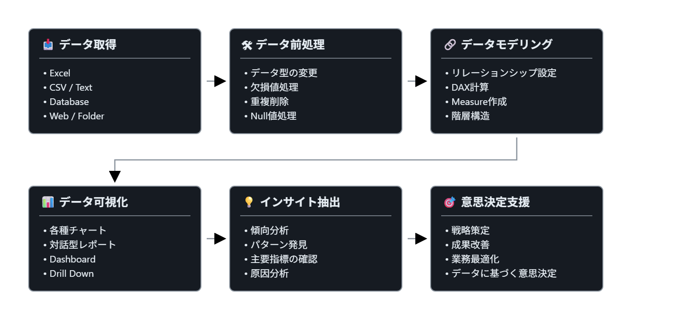

## 1. Power BI

Power BIは、データを分析・可視化し、意思決定を支援する`ビジネスインテリジェンス（BI）ツール`である。

---

## 2. Power BI Desktop

- データソースに接続し、データの変換およびモデリングを行うことができる。
- `「Power Query エディター」`を通じて、データの編集・結合、テーブル間のリレーションシップ設定、Measureの作成などを行うことができる。
- データモデルを利用し、さまざまなビジュアルを活用してレポートを作成できる。
- レポートを`Power BI Service`に発行できる。
- 要約すると、  
  **「データへの接続 → データ変換・モデリング → データ可視化 → レポート作成 → サービスへの発行」**  
  の順序で作業を行う。

---

#### ※ データ分析および手順

---

## 2. Power BIの構成要素

Power BIでは、**データ → 可視化 → レポート → ダッシュボード**の流れで分析結果を整理する。

| 構成要素 | 説明 | 例 |
|---|---|---|
| **データセット（Dataset）** | 分析に使用するデータ | CSV、Excel、Database |
| **ビジュアル（Visual）** | データを表現するグラフや表 | 棒グラフ、折れ線グラフ、カード、マップ |
| **レポート（Report）** | 複数のビジュアルを配置した分析画面 | 売上分析レポート |
| **ダッシュボード（Dashboard）** | 複数のレポートから重要な情報をまとめた画面 | CEO向け経営状況ダッシュボード |

### 各構成要素の役割

1. **Dataset**：何を分析するか
2. **Visual**：データをどのように表現するか
3. **Report**：複数のビジュアルをどのように組み合わせて分析するか
4. **Dashboard**：重要な情報を一つの画面でどのように確認するか

### ReportとDashboardの関係

```text
売上レポート ──┐
               │
在庫レポート ──┼──→ CEOダッシュボード
               │
顧客レポート ──┘