## 前処理が必要なデータセット

一部の処理は、Power Query エディターではなく、データをロードした後に**DAX式**で行うこともできる。

---

使用データ：`Sales_2024.csv`

#### ※ 基本的な前処理

データ読み込み時に基本的な前処理が自動で適用される。  
不要な場合は、**クエリ設定の「適用したステップ」から削除**する。

1. **ヘッダーの昇格**：1行目をヘッダーとして使用
2. **データ型の変更**：最初の200行を基準にデータ型を自動判定

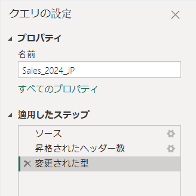

---

#### 0. 「データの取得」→「データの変換」を選択

ヘッダー（カラム名）が設定されていない場合、**1行目をヘッダーとして使用**できる。

**「変換」タブ →「1行目をヘッダーとして使用」**

---

`Sales_2024.csv`を使用し、**Power Query エディター**で以下の機能を実習する。

| 分類 | 主な機能 | 例 |
|---|---|---|
| **データ整理** | Filter、Sort、Rename、Remove Columns、Remove Duplicates | `Sales`、`Region`、`Remark`、`OrderID` |
| **データ変換** | Data Type、Replace Values、Split / Merge Columns | `Date`、`ZipCode`、`Region`、`ProductName`、`Phone` |
| **欠損値処理** | Fill Down、Fill Up | `Remark` |
| **列の作成** | Custom Column、Conditional Column、Index Column、Column From Examples | `Sales / Qty`、売上ランク、`CustomerName` |
| **クエリ操作** | Duplicate Query、Reference Query、Parameters | Query、売上フィルター |
| **データ確認・Mコード** | Formula Bar、Advanced Editor、Column Quality / Distribution / Profile | Mコード、`OrderDate`、`Region`、`Sales` |

---

#### ① データプロファイリングの確認

まず、データの状態を確認する。

「**表示**」タブ →「**データプレビュー**」から以下を有効にする。

> データを変更する機能ではなく、**各列の品質・分布・異常値などを確認するための機能**。

---

### ※ 確認ポイント

##### 1) 列の品質（Column Quality）

各カラムの **Valid / Error / Empty** の割合を確認する。

| カラム | 確認内容 |
|---|---|
| `OrderDate` | エラー値（例：`2024-13-01`）の有無 |
| `Remark` | Emptyが多く存在するか |
| `Qty` | Valid / Error / Empty の割合 |
| `Sales` | 負の値などの異常値が存在するか |
| `ZipCode` | 適切なデータ型として認識されているか |

---

##### 2) 列の分布（Column Distribution）

各カラムの **一意な値・重複値・出現頻度** を確認する。

| カラム | 確認内容 |
|---|---|
| `Region` | `東京`、`東京都`、`TOKYO`、`tokyo` が別の値として認識されているか |

> 同じ地域でも表記が異なると、**4種類の値として認識される**。

---

##### 3) 列のプロファイル（Column Profile）

選択したカラムの **最小値・最大値・平均・エラー・値の分布** などを確認する。

| カラム | 確認内容 |
|---|---|
| `Sales` | 最小値 `-300`、最大値 `999999` などの異常値を確認 |

> 前処理を行う前に、**エラー・欠損値・表記ゆれ・異常値・データ型**を確認することが重要。

## ▶▶▶ データ加工（前処理）段階

---

#### ② `OrderID`

##### - 確認

- 5件の重複を確認

##### メニュー

「**ホーム（Home）**」→「**行の削除**」→「**重複の削除**」

または

`OrderID`カラムを選択 → 右クリック →「**重複の削除**」

##### - 結果

- 重複している注文データを削除

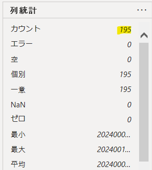

---

#### ③ `OrderDate`

##### 問題

日付の表記が統一されていない。

- `2024-01-01`
- `2024/01/01`
- `2024-13-01`

##### - データ型の変更

まず、`OrderDate`を**日付型**に変更する。

「**変換**」タブ →「**データ型：日付**」

または

`OrderDate`を右クリック →「**型の変更**」→「**日付**」

> `2024-13-01`のような無効な日付は、日付型へ変換すると**Error**になる。

##### - エラーの確認

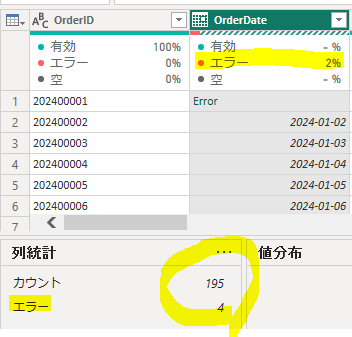

##### - エラーの処理

1) エラー行を削除する場合：

「**ホーム**」→「**行の削除**」→「**エラーの削除**」

または

`OrderDate`を右クリック →「**エラーの削除**」

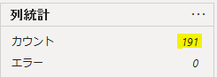

2) エラーを削除せず、別の値に変更する場合：

`OrderDate`を右クリック →「**エラーの置換**」

または

「**変換**」タブ →「**値の置換**」→「**エラーの置換**」

---

#### ④ `CustomerID`

##### - 確認

`C999`のような、実際には存在しない顧客コードが含まれていないか確認する。

フィルターを使用して、特定の顧客のみを抽出する。

##### メニュー

`CustomerID`カラムの ▼ →「**フィルター**」

##### - 実習

`C999`を検索してデータを確認する。

> 実在する顧客かどうかは、担当者や元データを確認したうえで処理する。

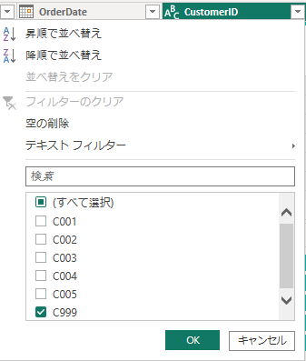

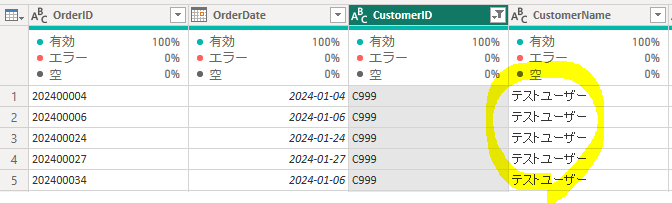

---

### ⑤ `CustomerName`

#### - 問題

`Test User`のような、実際の顧客名ではない値が含まれている。

#### - 処理

値の置換、またはフィルターを使用して処理する。

#### - 実習

`CustomerName`カラムの ▼ からフィルターを開き、`Test User`を除外する。

> `Test User`はテスト用のダミーデータとして削除する。

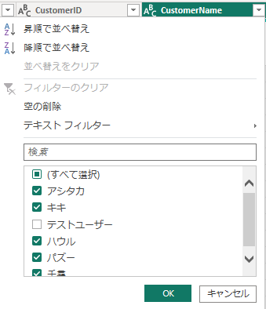

#### 適用したステップ

処理内容が分かりやすいように、適用したステップ名を変更する。

例：

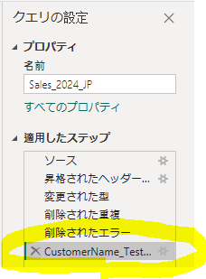

---

#### ⑥ `Region`

##### - 問題

同じ地域名が異なる表記で保存されている。

- `東京`
- `東京都`
- `TOKYO`
- `tokyo`

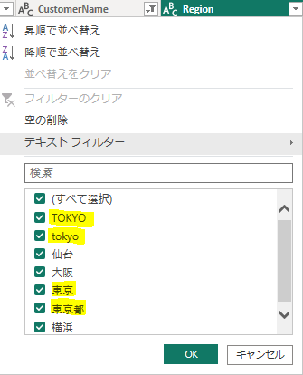

##### - 処理

##### 1) 表記を `東京` に統一する。

「**変換**」→「**値の置換**」

または

`Region`カラムを右クリック →「**値の置換**」

##### - 実習

- `tokyo` → `東京`
- `TOKYO` → `東京`
- `東京都` → `東京`

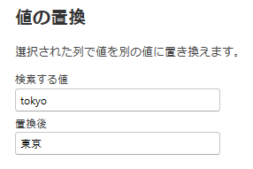

##### - 確認

「**列の分布**」で、地域名が `東京` に統一されていることを確認する。

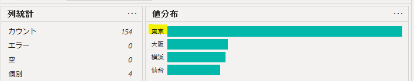

> 表記ゆれを統一することで、同じ地域が別のカテゴリとして集計されることを防ぐ。

##### 2) 元の`Region`列を残したまま、変換後の新しい列を追加する

元の列を変更せず、条件に応じて値を変換した**新しい列**を作成する。

「**列の追加**」→「**条件列**」

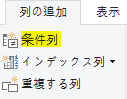

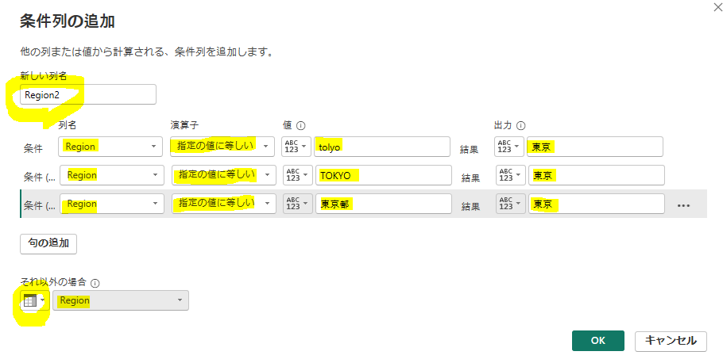

> SQLの`CASE`式と同様に、条件に応じて別の値を返すことができる。

##### - 結果

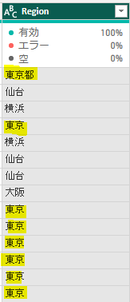
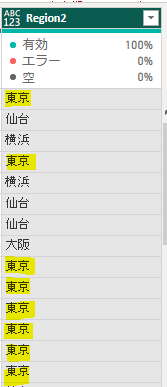

- 元の`Region`列はそのまま保持
- 表記を統一した`Region2`列を新しく作成

---

#### ⑧ `ProductName`

##### - 問題

同じ製品名が異なる表記で保存されている。

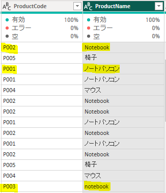

- `Notebook`
- `ノートパソコン`
- `notebook`

`ProductCode`を確認した結果、同じ製品ではない場合は、**担当者や元データを確認して処理する**。

> 製品名だけで判断せず、`ProductCode`などの識別子と合わせて確認する。

---

#### ⑩ `Qty`

##### - 確認

`Qty`が数値型として認識されているか確認する。

「**変換**」→「**データ型**」→「**整数**」

---

##### 1) `null`の確認

「**表示**」→「**列の品質（Column Quality）**」で`null`の割合を確認する。

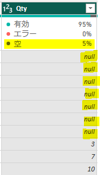

> `null`を無条件に`0`へ置き換えるのではなく、**業務上`null`が何を意味するか確認してから処理する**。

`null`を`0`に置き換える場合：

`Qty`カラムを右クリック →「**値の置換**」

##### 2) 数値フィルター

`Qty`カラムの ▼ →「**数値フィルター**」→「**より大きい**」

例：

`Qty > 5`

→ 数量が5より大きい注文のみを抽出する。

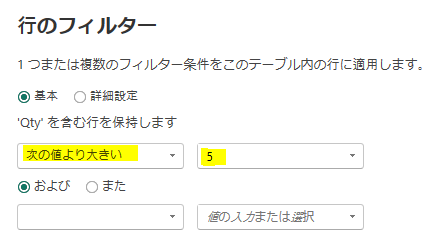
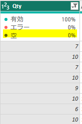

> `UnitPrice`・`Qty`・`Sales`には計算上の関係があるため、欠損値は勝手に補完せず、担当者や元データを確認して処理する。

---

#### ⑫ `Sales`

##### - 問題

`Sales`に以下のような異常値が存在する。

- 負の値（例：`-500`）
- 極端に大きい値（例：`999999`）

##### - 確認

「**列の分布**」または`Sales`カラムの「**数値フィルター**」を使用して異常値を確認する。

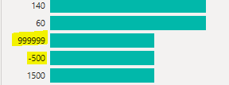

→ 負の値や極端に大きい値のみを抽出して確認する。

##### - 異常値の削除

確認時に使用した条件とは**反対の条件**でフィルターし、正常な値だけを残す。

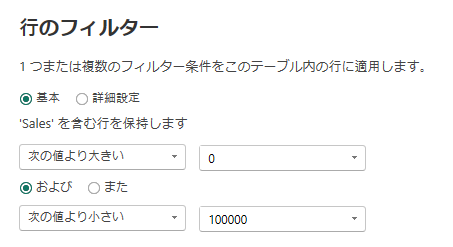

> 異常値は単純に削除せず、必要に応じて**元データや業務ルールを確認してから処理する**。

---

#### ⑬ `Status`

##### - 問題

`Status`に`Unknown`が約15〜20％含まれており、単純に削除するとデータ損失が大きくなる。

実際に`Unknown`という状態が存在するか、担当者や元データを確認する。

> 商品状態などで`Unknown`が実際のカテゴリではない場合は、`null`に変更して**欠損値として明確に扱う**方法が適している。

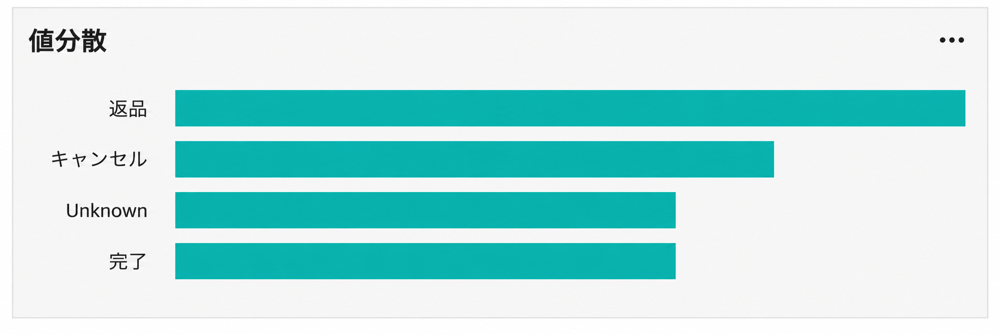

##### - 処理

`Status`カラムを右クリック →「**値の置換**」

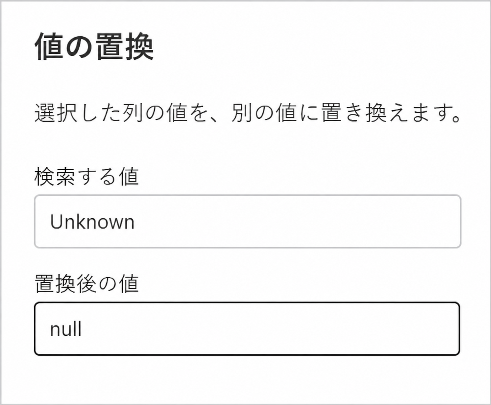

##### - 確認

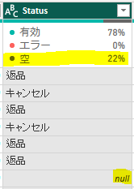
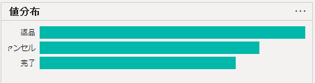