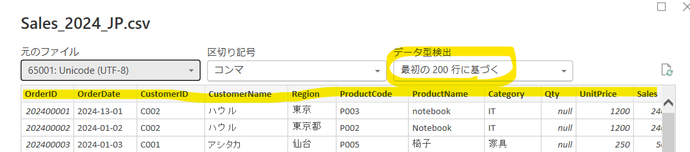
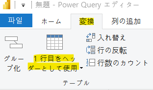
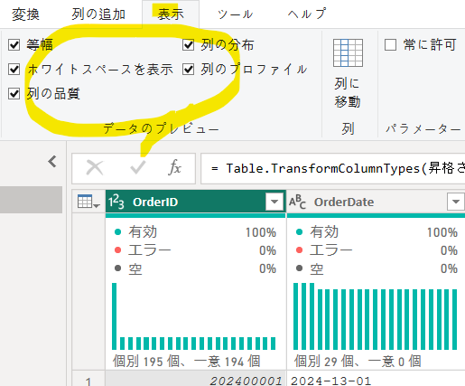
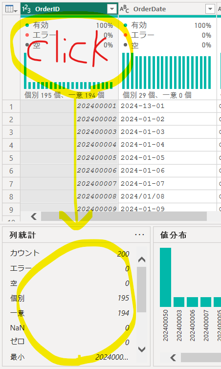
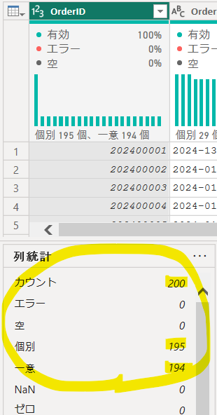
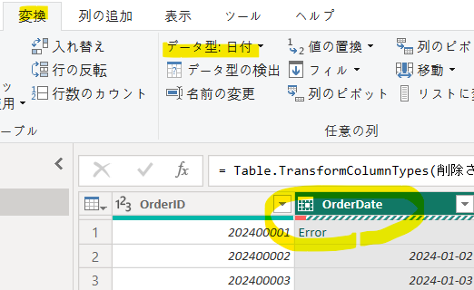
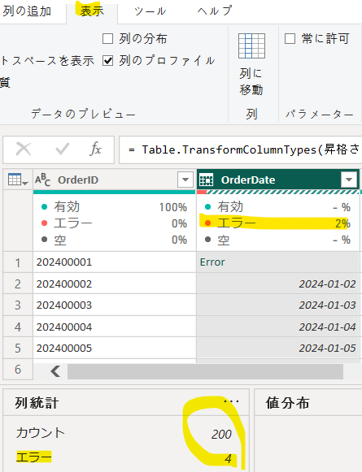

## 前処理が必要なデータセット

一部の処理は、Power Query エディターではなく、データをロードした後に**DAX式**で行うこともできる。

---

使用データ：`Sales_2024.csv`

#### ※ 基本的な前処理

データ読み込み時に基本的な前処理が自動で適用される。  
不要な場合は、**クエリ設定の「適用したステップ」から削除**する。

1. **ヘッダーの昇格**：1行目をヘッダーとして使用
2. **データ型の変更**：最初の200行を基準にデータ型を自動判定

---

#### 0. 「データの取得」→「データの変換」を選択

ヘッダー（カラム名）が設定されていない場合、**1行目をヘッダーとして使用**できる。

**「変換」タブ →「1行目をヘッダーとして使用」**

---

`Sales_2024.csv`を使用し、**Power Query エディター**で以下の機能を実習する。

| 分類 | 主な機能 | 例 |
|---|---|---|
| **データ整理** | Filter、Sort、Rename、Remove Columns、Remove Duplicates | `Sales`、`Region`、`Remark`、`OrderID` |
| **データ変換** | Data Type、Replace Values、Split / Merge Columns | `Date`、`ZipCode`、`Region`、`ProductName`、`Phone` |
| **欠損値処理** | Fill Down、Fill Up | `Remark` |
| **列の作成** | Custom Column、Conditional Column、Index Column、Column From Examples | `Sales / Qty`、売上ランク、`CustomerName` |
| **クエリ操作** | Duplicate Query、Reference Query、Parameters | Query、売上フィルター |
| **データ確認・Mコード** | Formula Bar、Advanced Editor、Column Quality / Distribution / Profile | Mコード、`OrderDate`、`Region`、`Sales` |

---

#### ① データプロファイリングの確認

まず、データの状態を確認する。

「**表示**」タブ →「**データプレビュー**」から以下を有効にする。

> データを変更する機能ではなく、**各列の品質・分布・異常値などを確認するための機能**。

---

### ※ 確認ポイント

##### 1) 列の品質（Column Quality）

各カラムの **Valid / Error / Empty** の割合を確認する。

| カラム | 確認内容 |
|---|---|
| `OrderDate` | エラー値（例：`2024-13-01`）の有無 |
| `Remark` | Emptyが多く存在するか |
| `Qty` | Valid / Error / Empty の割合 |
| `Sales` | 負の値などの異常値が存在するか |
| `ZipCode` | 適切なデータ型として認識されているか |

---

##### 2) 列の分布（Column Distribution）

各カラムの **一意な値・重複値・出現頻度** を確認する。

| カラム | 確認内容 |
|---|---|
| `Region` | `東京`、`東京都`、`TOKYO`、`tokyo` が別の値として認識されているか |

> 同じ地域でも表記が異なると、**4種類の値として認識される**。

---

##### 3) 列のプロファイル（Column Profile）

選択したカラムの **最小値・最大値・平均・エラー・値の分布** などを確認する。

| カラム | 確認内容 |
|---|---|
| `Sales` | 最小値 `-300`、最大値 `999999` などの異常値を確認 |

> 前処理を行う前に、**エラー・欠損値・表記ゆれ・異常値・データ型**を確認することが重要。

## ▶▶▶ データ加工（前処理）段階

#### ② `OrderID`

##### 確認

- 5件の重複を確認

##### メニュー

「**ホーム（Home）**」→「**行の削除**」→「**重複の削除**」

または

`OrderID`カラムを選択 → 右クリック →「**重複の削除**」

##### 結果

- 重複している注文データを削除

#### ③ `OrderDate`

##### 問題

日付の表記が統一されていない。

- `2024-01-01`
- `2024/01/01`
- `2024-13-01`

##### データ型の変更

まず、`OrderDate`を**日付型**に変更する。

「**変換**」タブ →「**データ型：日付**」

または

`OrderDate`を右クリック →「**型の変更**」→「**日付**」

> `2024-13-01`のような無効な日付は、日付型へ変換すると**Error**になる。

##### - エラーの確認

##### - エラーの処理

エラー行を削除する場合：

「**ホーム**」→「**行の削除**」→「**エラーの削除**」

または

`OrderDate`を右クリック →「**エラーの削除**」

エラーを削除せず、別の値に変更する場合：

`OrderDate`を右クリック →「**エラーの置換**」

または

「**変換**」タブ →「**値の置換**」→「**エラーの置換**」

