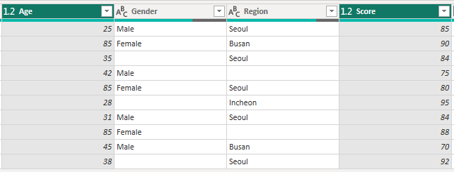
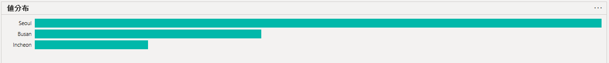
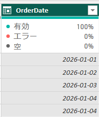

## 1. 欠損値（Missing Value）

欠損値とは、`データセット内で値が欠けている状態`を指す。

例：

- アンケートで特定の質問（所得・年齢など）に回答していない場合
- 仮想測定センサーの一時的な故障により、一定時間の値が記録されていない場合
- プログラミングやデータベースで `Null`、`NaN`、`None` などとして表現される値

欠損値を適切に処理しないと、**計算エラーや分析結果の偏り**が発生する可能性がある。

---

#### 1) 代表的な処理方法

| 方法 | 説明 | 使用する状況 |
|---|---|---|
| **削除（Deletion）** | 欠損値を含む行または列を削除する | データ量が十分に多い場合 |
| **補完（Imputation）** | 平均値・中央値・直前の値・予測モデルなどで欠損値を補う | データの損失を抑えたい場合 |

#### 2) 処理手順

① **列のデータ型を確認**  
② **NULLが発生した原因を確認**  
③ **業務上の意味を確認**  
④ **適切な処理方法を選択**

---

## 2. データ型別の欠損値処理

欠損値の処理方法は、**データ型と業務上の意味に応じて選択する**。

| データ型 | 主な処理方法 | ポイント | 例 |
|---|---|---|---|
| **数値** | 平均値・中央値・最頻値 | 外れ値がある場合は中央値を優先 | 年齢、売上、点数 |
| **カテゴリ** | 最頻値・`Unknown` | 分布の偏りに注意 | 性別、地域、商品 |
| **順序データ** | 中央値・最頻値 | 順序関係を考慮 | 等級、満足度 |
| **日付** | 削除・前後の日付を使用 | 日付を平均値で補完しない | 注文日 |
| **時系列** | Forward Fill・Backward Fill・補間 | 時間の順序を考慮 | 日別売上、株価 |
| **ID** | 削除・元データを確認 | 任意の値で補完しない | `CustomerID`、`OrderID` |
| **テキスト** | `Unknown`・空文字列 | 分析目的に応じて処理 | 住所、メモ |
| **計算列** | 元の列から再計算 | 平均値などで単純補完しない | 売上 = 数量 × 単価 |

※ 欠損値は一律に補完せず、**データの意味を確認してから処理方法を決める**。

---

## 3. 実習

#### - 実習データの欠損値処理

| カラム | データ型 | 処理方法 |
|---|---|---|
| `Age` | 数値型 | 中央値 |
| `Gender` | カテゴリ型 | `"Unknown"` |
| `Region` | カテゴリ型 | `"Unknown"` |
| `Score` | 数値型 | 中央値 |
| `OrderDate` | 日付型 | 元データを確認 / 行を削除 |
| `Quantity` | 数値型 | 業務ルールを確認 |
| `Price` | 数値型 | 元データを利用 |
| `CustomerID` | 識別子 | 元データを確認 / 行を削除 |
| `Comment` | テキスト | `"Unknown"` |

---

#### 1) 数値型データ：`Age`、`Score`


- `平均値`：一般的によく使用されるが、外れ値の影響を受けやすい
- `中央値`：外れ値の影響を受けにくいため、外れ値が多い場合に適している

---

#### Power Queryで平均値を確認する方法

1. 対象のカラムを選択
2. `変換` → `統計` → `平均`
3. 表やリストに変換せず、表示された値だけを確認・コピーする
4. 必要な値を確認したら、適用せずに操作を取り消す


##### - 処理

カラム名 右クリック → 値を変更


##### - 結果



---

#### 2) カテゴリ型データ：`Gender`、`Region`

カテゴリ型データでは平均値を使用できないため、**最頻値または `"Unknown"`** などで欠損値を処理する。


#### ① 最頻値で補完

最も多く出現する値で欠損値を置き換える方法。

**Power Queryでの確認方法**

1. `表示` → `列プロファイル` を有効化
2. `値の分布` から最も多い値を確認
3. 最も`頻繁に現れる値`を使用する。



#### ② `"Unknown"` で補完

実際に値が不明である場合は、無理に推測せず `"Unknown"` として保持する。

#### - 結果


> 「情報が存在しない」という状態自体に意味がある場合は、`Unknown` として残す方法が適している。

---

#### 3) 日付型データ：`OrderDate`

日付の欠損値は、**データの意味や時系列性を確認して処理方法を決める**。

- **平均値**：基本的に推奨しない
- **中央値**：特殊な場合のみ使用
- **削除**：必要に応じて可能
- **Forward Fill（前方補完）**：時系列データで使用可能
- **Backward Fill（後方補完）**：時系列データで使用可能

##### # Forward Fill

`OrderDate` を右クリック →「**フィル**」→「**下へ**」



→ 直前の日付を使って欠損値を補完する。

※ 日付データでは、単純に平均値で補完するのではなく、**時間的な順序や業務上の意味を考慮する**。

---

#### 4) 数量データ - `Quantity`

`Quantity` が `NULL` だからといって、必ず平均値で補完するとは限らない。

まず、**業務上の意味を確認してから処理方法を決める**。

- `NULL` = 実際の数量が `0` を意味する  
  → `NULL` を `0` に置換する。

- `NULL` = 数量データそのものが欠損している  
  → `0` に置換するのは適切ではない。

---

#### 5) 価格データ - `Price`

`Price` が `NULL` の場合、単純に平均値で補完するより、**商品価格などの元データを利用して補完する方が適切**。

- 元データに価格情報がある場合 → その値を使用
- 別の参照テーブルに商品価格がある場合 → その値を使用

※ 価格のように正しい値を確認できるデータは、平均値による補完より**元データからの補完を優先する**。

---

## 8. Power Query 実習の流れ

```text
CSV ファイル
    ↓
Power Query エディター
    ↓
① 列の品質・分布を確認
    ↓
② 欠損値を確認
    ↓
③ データ型を確認
    ↓
④ データ型ごとに分類
    ↓

┌────────────┬──────────────────────────┐
│ 数値型     │ → 平均値 / 中央値          │
│ カテゴリ型 │ → 最頻値 / Unknown         │
│ 日付型     │ → 削除 / 前後の値          │
│ 時系列     │ → Fill Down / Up / 補間   │
│ 識別子     │ → 削除 / 元データを確認     │
│ テキスト   │ → Unknown / 空文字列       │
└────────────┴──────────────────────────┘

    ↓
欠損値を処理
    ↓
Column Quality を再確認
    ↓
閉じて適用
```