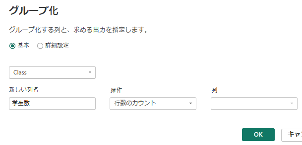
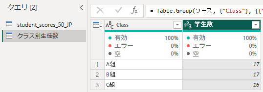
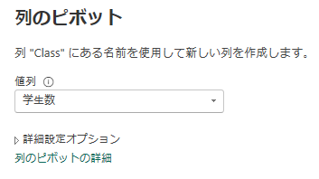
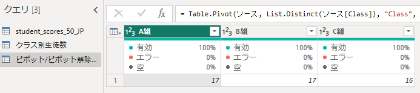
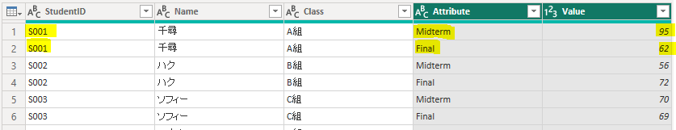
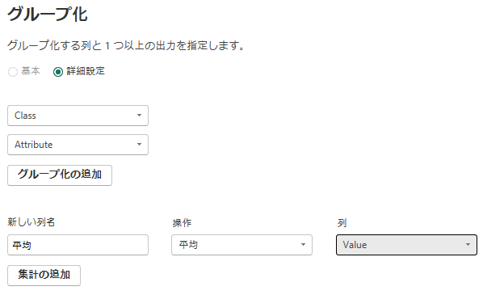
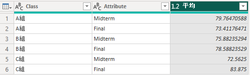
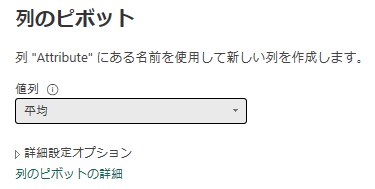
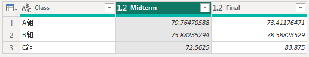

使用ファイル：`student_scores_50.csv`

## 1. グループ化 → ピボット → ピボット解除

Power Queryの「グループ化」は、SQLの`GROUP BY`と同じように、指定した列を基準にデータをまとめて集計できる。

---

#### 1) グループ化

##### -  参照

グループ化で使用する元のクエリを右クリックし、参照用のクエリを作成する。

元データを残したまま、別のクエリでグループ化などの加工を行うことができる。

##### - Class カラムを選択 → ホーム → グループ化または変換 → グループ化

##### - 結果

---

## 2) ピボット / ピボット解除

#### - ピボット（Pivot）とは

特定の列の値（行データ）を、新しい列名として展開する機能。

#### - ピボット解除（Unpivot）とは

複数の列を「属性」と「値」の形式の行データに変換する機能。

##### # ピボットの実習

元のクエリを「**参照**」して新しいクエリを作成し、名前を「**ピボット/ピボット解除実習**」に変更する。

##### - 処理

「**変換**」タブ →「**ピボット列**」を選択する。

`Class`列をピボット対象として指定し、値の列には「学生数」を設定する。

##### - 実行結果

`Class`列の値が、それぞれ新しい列として展開される。

つまり、`Class`列にあった`A組`・`B組`・`C組`が列名に変換され、それぞれの学生数が集計される。

##### # ピボット解除

- 3つのカラムをCtrlキーを押しながら選択し、変換 → 列のピボットを解除 

---

## 3) 実習

#### ※ ピボット解除を使用する理由

正規化されたRDBでは、複数のテーブルを`JOIN`して分析することが多い。

一方、同じ種類の値が複数の列に分かれているデータは、分析目的に応じて「**ピボット解除**」を使用すると扱いやすい形に変換できる。

今回のデータでは、`Midterm`と`Final`がそれぞれ別の列になっているため、これらを行形式に変換する。

---

#### 1) 参照クエリを作成

`student_scores_50`を右クリック  
→「**参照**」  
→ クエリ名を実習用の名前に変更する。

#### 2) 対象列を選択

`Ctrl`キーを押しながら、次の2列を選択する。

- `Midterm`
- `Final`

#### 3) ピボット解除

「**変換**」タブ →「**列のピボット解除**」を選択する。

`Midterm`と`Final`の2列が、次の2列に変換される。

- `Attribute`：`Midterm` / `Final`
- `Value`：それぞれの点数

##### - 実行結果

元データは50行だが、1人につき`Midterm`と`Final`の2行が生成されるため、**100行**になる。

---

#### 4) 複数列を基準にグループ化

`Ctrl`キーを押しながら、

- `Class`
- `Attribute`

の2列を選択する。

その後、「**グループ化**」を選択し、「**詳細設定**」を使用して複数の列をグループ化の基準に指定する。

##### - 実行結果

---

#### 5) `Attribute`列をピボット

`Attribute`列を選択し、

「**変換**」タブ →「**ピボット列**」を選択する。

値の列には、グループ化で計算した「**平均**」を指定する。

これにより、`Attribute`列にあった

- `Midterm`
- `Final`

が、それぞれ新しい列として展開される。

##### - 実行結果

各クラスごとの`Midterm`と`Final`の平均点を、列形式で確認できる。

---

#### 6. ピボット解除

`Midterm`と`Final`の2列を選択し、

「**変換**」タブ →「**列のピボット解除**」を選択する。

必要に応じて、生成された列名を変更する。

ピボットによって列形式に変換したデータを、再び`Attribute`・`Value`形式の行データに戻すことができる。