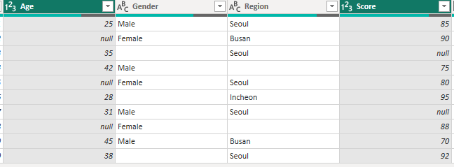
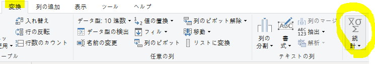
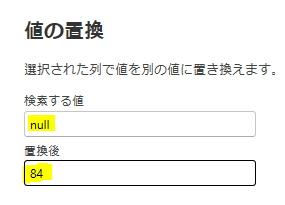
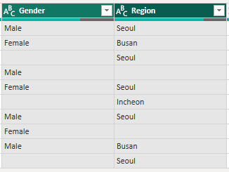
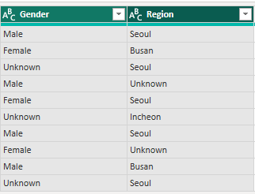

## 1. 欠損値（Missing Value）

欠損値とは、`データセット内で値が抜けている状態`を指す。

- アンケートで特定の質問に回答しなかった場合
- センサーが一時的に停止した場合
- `Null`、`NaN`、`None` などで表される

---

#### 1) 代表的な処理方法

| 方法 | 説明 | 使用する状況 |
|---|---|---|
| 削除（Deletion） | 欠損値を含む行や列を削除する | データ量が十分に多い場合 |
| 補完（Imputation） | 平均値・中央値などで置き換える | データ損失を減らしたい場合 |

---

#### 2) 処理手順

1. カラムのデータ型を確認
2. NULLが発生した理由を確認
3. 業務上の意味を確認
4. 適切な処理方法を選択

---

## 2. データ型別の欠損値処理

| データ型 | 例 | 代表的な処理方法 | ポイント |
|---|---|---|---|
| 数値型 | 年齢、売上、点数 | 平均値、中央値 | **外れ値がある場合は中央値**が適している |
| カテゴリ型 | 性別、地域、商品 | 最頻値、`"Unknown"` | 最頻値での補完は分布を歪める可能性がある |
| 日付型 | 注文日、登録日 | 削除、前後の日付、補間 | 単純に平均値で補完しない |
| 時系列 | 日別売上、株価 | Forward Fill、Backward Fill、補間 | **時間の順序を考慮**して補完する |
| 識別子 | 顧客ID、注文ID | 削除、元データを確認 | **任意の値で補完しない** |
| テキスト | 住所、メモ | `"Unknown"`、空文字列 | 分析目的に応じて処理する |
| 計算結果 | 売上 = 数量 × 単価 | 元データから再計算 | 単純な平均値補完より**再計算を優先**する |

---

#### 例) 欠損値処理

| データ | 欠損値の処理 |
|---|---|
| 年齢・点数 | 平均値 / 中央値 |
| 売上 | 平均値 / 中央値 / 業務ルール |
| 性別・地域 | 最頻値 / `"Unknown"` |
| 日付 | 削除 / 前後の値 / 補間 |
| 時系列 | Forward Fill / Backward Fill / 補間 |
| 数量・価格 | 業務ルールや元データを確認して補完 |
| 顧客ID・注文ID | 元データを確認し、必要に応じて削除 |
| 計算列 | 元データから再計算 |

---

## 3. 実習

#### - 実習データの欠損値処理

| カラム | データ型 | 処理方法 |
|---|---|---|
| `Age` | 数値型 | 中央値 |
| `Gender` | カテゴリ型 | `"Unknown"` |
| `Region` | カテゴリ型 | `"Unknown"` |
| `Score` | 数値型 | 中央値 |
| `OrderDate` | 日付型 | 元データを確認 / 行を削除 |
| `Quantity` | 数値型 | 業務ルールを確認 |
| `Price` | 数値型 | 元データを利用 |
| `CustomerID` | 識別子 | 元データを確認 / 行を削除 |
| `Comment` | テキスト | `"Unknown"` |

---

#### 1) 数値型データ：`Age`、`Score`

- `平均値`：一般的によく使用されるが、外れ値の影響を受けやすい
- `中央値`：外れ値の影響を受けにくいため、外れ値が多い場合に適している

---

#### Power Queryで平均値を確認する方法

1. 対象のカラムを選択
2. `変換` → `統計` → `平均`
3. 表やリストに変換せず、表示された値だけを確認・コピーする
4. 必要な値を確認したら、適用せずに操作を取り消す

カラム名 右クリック → 値を変更

結果

---

### 2) カテゴリ型データ：`Gender`、`Region`

カテゴリ型データでは平均値を使用できないため、**最頻値または `"Unknown"`** などで欠損値を処理する。

#### ① 最頻値で補完

最も多く出現する値で欠損値を置き換える方法。

**Power Queryでの確認方法**

1. `表示` → `列プロファイル` を有効化
2. `値の分布` から最も多い値を確認
3. 最も`頻繁に現れる値`を使用する。

#### ② `"Unknown"` で補完

実際に値が不明である場合は、無理に推測せず `"Unknown"` として保持する。

結果

> 「情報が存在しない」という状態自体に意味がある場合は、`Unknown` として残す方法が適している。

---

### 3) 日付型データ：`OrderDate`

日付の欠損値は、**データの意味や時系列性を確認して処理方法を決める**。

| 処理方法 | 使用するケース |
|---|---|
| 削除 | 日付が必須であり、元データでも確認できない場合 |
| Forward Fill | 時系列データで直前の日付・値を引き継げる場合 |
| Backward Fill | 時系列データで直後の日付・値を使用できる場合 |
| 元データ確認 | 注文日など業務上重要な日付の場合 |

- **平均値による補完は基本的に推奨しない**
- 中央値も、業務上意味がある場合にのみ使用する
- 時系列データでは **Forward Fill / Backward Fill** を利用できる

> `OrderDate` のような業務上重要な日付は、単純に補完するのではなく、まず**元データを確認することが重要**。
