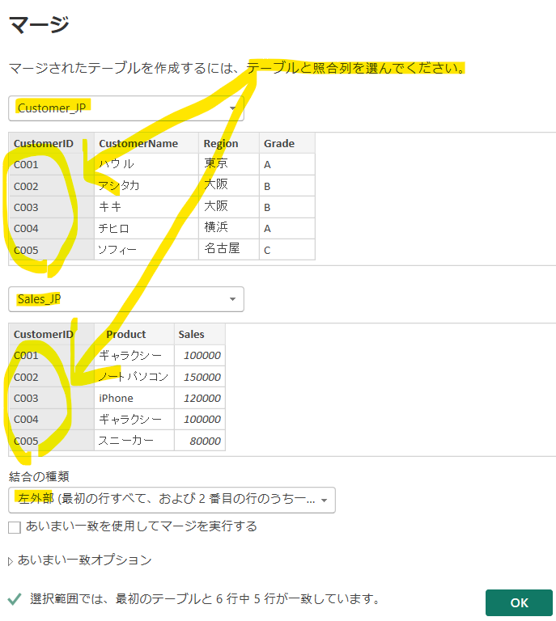
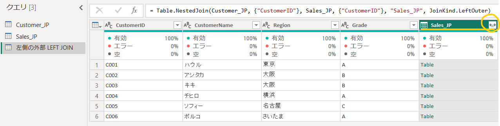
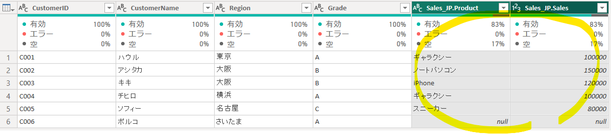
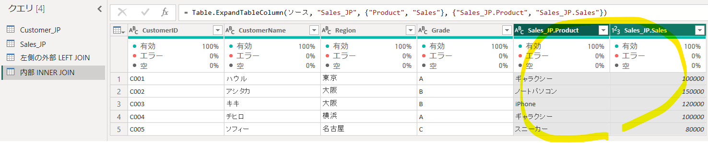
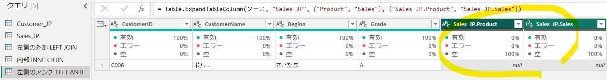

## クエリのマージ（JOIN）

#### ※ クエリのマージ vs モデリング（リレーションシップ設定）

| 区分 | クエリのマージ | テーブルモデリング（リレーションシップ） |
|---|---|---|
| **タイミング** | データ前処理の段階 | データモデルの段階 |
| **メニュー** | Power Query エディター | モデルビュー |
| **SQLの概念** | `JOIN` | テーブル間の関係 |
| **結果** | 2つのテーブルの列を1つのテーブルに結合 | テーブルを分離したまま維持 |
| **目的** | データの整形・統合 | 分析構造の設計 |
| **データサイズ** | 結果テーブルが大きくなる場合がある | 必要なテーブルを分離して維持 |
| **関係** | マージ後は別途リレーションシップが不要な場合もある | リレーションシップの設定が必要 |
| **例** | `Sales + Customer` | `Sales ↔ Customer` |

※ 前処理で実際に列を1つのテーブルにまとめる必要がある場合は **マージ（Merge）** を使用する。

※ 分析用のスター・スキーマを維持する場合は、ファクトテーブルとディメンションテーブルを分離し、**リレーションシップ（Relationship）** を設定する方法が一般的。

※ Power BIではSQLのようにJOIN文を直接記述しなくても、モデル上でファクトテーブルとディメンションテーブルをリレーションシップで接続することで、複数テーブルの列を同じレポート・ビジュアルで利用できる。

---

#### 1) クエリのマージ

「**ホーム**」タブ →「**クエリのマージ**」→「**クエリを新しいクエリとしてマージ**」

使用データ：

- `Customer.csv`
- `Sales.csv`

マージ時に、以下の結合方法を選択できる。

| Power Query | SQL | 意味 |
|---|---|---|
| **左外部** | `LEFT JOIN` | 左テーブルの全行 + 右テーブルの一致データ |
| **右外部** | `RIGHT JOIN` | 右テーブルの全行 + 左テーブルの一致データ |
| **完全外部** | `FULL OUTER JOIN` | 両方のテーブルの全行 |
| **内部** | `INNER JOIN` | 両方のテーブルに存在するデータのみ |
| **左反結合** | `LEFT ANTI JOIN` | 左テーブルにのみ存在するデータ |
| **右反結合** | `RIGHT ANTI JOIN` | 右テーブルにのみ存在するデータ |

※ MySQLには `ANTI JOIN` という構文がないため、一般的に `NOT EXISTS` などを使用して同様の処理を行う。

---

#### ① 左外部結合（LEFT JOIN）

Customer全体 + Salesマッチング結果セット

右側テーブルを展開

#### 2) 右側の外側

#### 3) 全体外部

#### 4) 内部

#### 5) 左側のアンチ

#### 6) 右側のアンチ