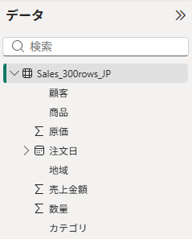
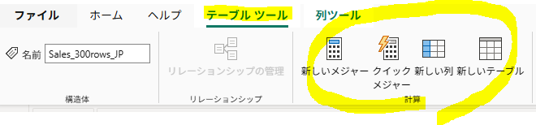

使用ファイル：`Sales_300rows.csv`

## 1. テーブルビューとデータペイン

Power BIでは「`テーブルビュー`」から、読み込んだデータの内容や列の構成を確認できる。

右側の「`データ`」ペインでは、次のような操作ができる。

- テーブルや列の確認
- テーブル・列の非表示
- 名前の変更
- フィールドの選択



<br>

また、列名の前に表示されるアイコンによって、そのフィールドの`データ型や役割`を確認できる。

<br>


<br>

- 選択した列に対して、並べ替え基準（昇順・降順）、フィルター、レポートビューで非表示などを設定できる。
- 「`列ツール`」では、書式の変更、簡単な日付・通貨スタイル、小数点以下の桁数などを調整できる。


---

## 2. DAX（Data Analysis Expressions）

- Power BIでデータを`計算・分析するための数式言語`。
- DAXは、すでに読み込まれているデータモデルを基準に`分析値を計算`するときに使用する。
-` 列またはテーブルを参照`して数式を作成する。
- データ分析に使用できるさまざまな関数を提供する。



### 1) DAX構文

```sql
名前 = 関数(テーブル名[列名])
```

例：

```sql
総売上 = SUM('販売'[売上])
```

```sql
総売上 → 新しく作成するメジャー名
= → 数式の開始
SUM() → 関数
'販売'[売上] → テーブルの特定の列
```

### 2) DAX演算子

実務でよく使用する演算子を中心に整理する。

| 種類 | 演算子 | 意味 | 例 |
|---|---|---|---|
| 算術 | `+` | 加算 | `[売上] + [追加額]` |
|  | `-` | 減算 | `[売上] - [原価]` |
|  | `*` | 乗算 | `[単価] * [数量]` |
|  | `/` | 除算 | `[売上] / [数量]` |
| 比較 | `=` | 等しい | `[地域] = "東京"` |
|  | `<>` | 等しくない | `[地域] <> "東京"` |
|  | `>` | より大きい | `[売上] > 1000000` |
|  | `<` | より小さい | `[売上] < 1000000` |
|  | `>=` | 以上 | `[売上] >= 1000000` |
|  | `<=` | 以下 | `[売上] <= 1000000` |
| 論理 | `&&` | AND（両方の条件を満たす） | `[売上] > 1000000 && [地域] = "東京"` |
|  | `\|\|` | OR（いずれかの条件を満たす） | `[地域] = "東京" \|\| [地域] = "大阪"` |
|  | `NOT` | 条件を否定する | `NOT([地域] = "東京")` |
| 文字列 | `&` | 文字列を連結する | `[姓] & [名]` |

> `=`, `<>`, `>`, `<`, `>=`, `<=`は、`IF`や`CALCULATE`などで条件を指定するときによく使用する。