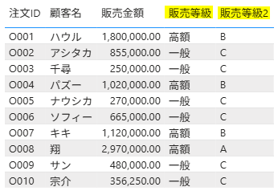
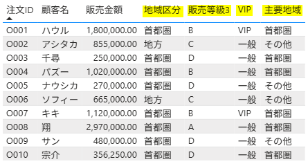
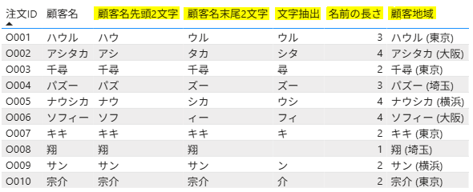
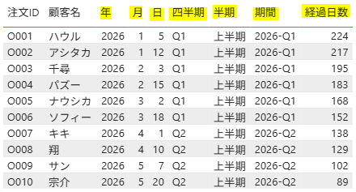
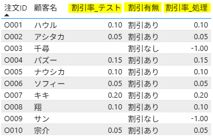
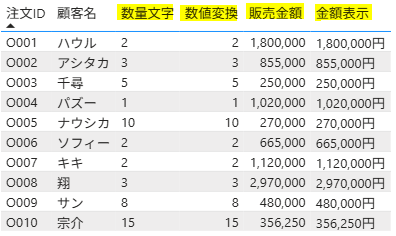

使用ファイル：`新列関数.csv`

---

## 1. 算術関数

```sql
売上 = '販売'[数量] * '販売'[単価]

割引金額 = '販売'[数量] * '販売'[単価] * '販売'[割引率]

販売金額 = '販売'[数量] * '販売'[単価] * (1 - '販売'[割引率])

販売金額丸め = ROUND('販売'[販売金額], -3)
```


---

## 2. 論理関数

```sql
販売等級 =
IF(
    '販売'[販売金額] >= 1000000,
    "高額",
    "一般"
)
```

```sql
販売等級2 =
IF(
    '販売'[販売金額] >= 2000000,
    "A",
    IF(
        '販売'[販売金額] >= 1000000,
        "B",
        "C"
    )
)
```
#### - 最終結果



---

※ 条件が多い場合は `SWITCH(TRUE())` のほうが可読性が高い。

```sql
# 値を比較 

SWITCH(列, 値1, 結果1, ...)
```

```sql
# 条件を比較

SWITCH(TRUE(), 条件1, 結果1, ...)
```

---

```sql
地域区分 =
SWITCH(
    '販売'[地域],
    "東京", "首都圏",
    "埼玉", "首都圏",
    "横浜", "首都圏",
    "大阪", "地方",
    "その他"
)
```

```sql
販売等級3 =
SWITCH(
    TRUE(),
    '販売'[販売金額] >= 2000000, "A",
    '販売'[販売金額] >= 1000000, "B",
    '販売'[販売金額] >= 500000, "C",
    "D"
)
```

```sql
VIP =
IF(
    '販売'[販売金額] >= 1000000
        && '販売'[地域] = "東京",
    "VIP",
    "一般"
)
```

```sql
主要地域 =
IF(
    '販売'[地域] = "東京"
        || '販売'[地域] = "埼玉",
    "首都圏",
    "その他"
)
```
#### - 最終結果



---

## 3. 文字列関数

#### # LEFT関数

```sql
顧客名先頭2文字 =
LEFT('販売'[顧客名], 2)
```

#### # RIGHT関数

```sql
顧客名末尾2文字 =
RIGHT('販売'[顧客名], 2)
```

#### # MID関数

```sql
文字抽出 =
MID('販売'[顧客名], 2, 2)
```

#### # LEN関数

```sql
名前の長さ =
LEN('販売'[顧客名])
```

#### # 文字列の連結

```sql
顧客情報 =
'販売'[顧客名] & " (" & '販売'[地域] & ") "
```

#### - 最終結果



---

## 4. 日付関数

#### # YEAR関数

```sql
年 =
YEAR('販売'[注文日])
```

#### # MONTH関数

```sql
月 =
MONTH('販売'[注文日])
```

#### # DAY関数

```sql
日 =
DAY('販売'[注文日])
```

#### # 四半期

```sql
四半期 =
"Q" & ROUNDUP(MONTH('販売'[注文日]) / 3, 0)
```

#### # 半期

```sql
半期 =
IF(
    MONTH('販売'[注文日]) <= 6,
    "上半期",
    "下半期"
)
```

#### # 期間

```sql
期間 =
YEAR('販売'[注文日])
    & "-"
    & "Q"
    & ROUNDUP(MONTH('販売'[注文日]) / 3, 0)
```

#### # 2つの日付間の期間を計算

```sql
経過日数 =
DATEDIFF(
    '販売'[注文日],
    TODAY(),
    DAY
)
```

#### - 最終結果



---

## 4. 空白値処理関数

#### # ISBLANK関数

```sql
割引有無 =
IF(
    ISBLANK('販売'[割引率_テスト]),
    "割引なし",
    "割引あり"
)
```

#### # COALESCE関数

空白値を別の値に置き換える。

```sql
割引率_処理 =
COALESCE(
    '販売'[割引率_テスト],
    -1
)
```

#### - 最終結果



---

## 5. 型変換関数

#### # VALUE関数

```sql
数値変換 =
VALUE('販売'[数量文字])
```

#### # FORMAT関数

書式を指定して表示する。

```sql
金額表示 =
FORMAT(
    '販売'[販売金額],
    "#,##0円"
)
```

#### - 最終結果

