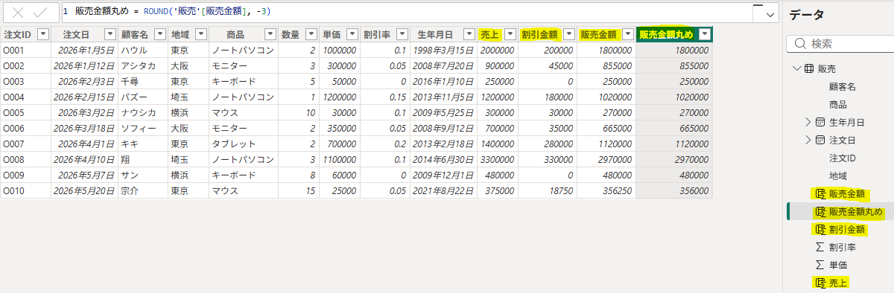
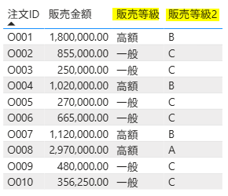
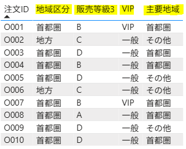

使用ファイル：`新列関数.csv`

---

## 1. 算術関数

```sql
売上 = '販売'[数量] * '販売'[単価]

割引金額 = '販売'[数量] * '販売'[単価] * '販売'[割引率]

販売金額 = '販売'[数量] * '販売'[単価] * (1 - '販売'[割引率])

販売金額丸め = ROUND('販売'[販売金額], -3)
```


---

## 2. 論理関数

```sql
販売等級 =
IF(
    '販売'[販売金額] >= 1000000,
    "高額",
    "一般"
)
```

```sql
販売等級2 =
IF(
    '販売'[販売金額] >= 2000000,
    "A",
    IF(
        '販売'[販売金額] >= 1000000,
        "B",
        "C"
    )
)
```
#### - 最終結果



---

※ 条件が多い場合は `SWITCH(TRUE())` のほうが可読性が高い。

```sql
# 値を比較 

SWITCH(列, 値1, 結果1, ...)
```

```sql
# 条件を比較

SWITCH(TRUE(), 条件1, 結果1, ...)
```

---

```sql
地域区分 =
SWITCH(
    '販売'[地域],
    "東京", "首都圏",
    "埼玉", "首都圏",
    "横浜", "首都圏",
    "大阪", "地方",
    "その他"
)
```

```sql
販売等級3 =
SWITCH(
    TRUE(),
    '販売'[販売金額] >= 2000000, "A",
    '販売'[販売金額] >= 1000000, "B",
    '販売'[販売金額] >= 500000, "C",
    "D"
)
```

```sql
VIP =
IF(
    '販売'[販売金額] >= 1000000
        && '販売'[地域] = "東京",
    "VIP",
    "一般"
)
```

```sql
主要地域 =
IF(
    '販売'[地域] = "東京"
        || '販売'[地域] = "埼玉",
    "首都圏",
    "その他"
)
```
#### - 最終結果



---