使用ファイル：`Sales_JP.csv`

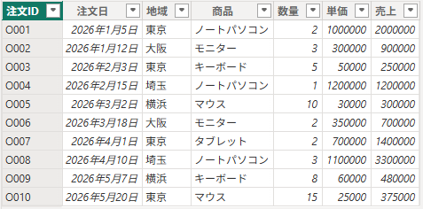

---

## 2. よく使う集計関数

| 関数 | 意味 | 例 |
|---|---|---|
| `SUM` | 合計 | `SUM('販売'[売上])` |
| `AVERAGE` | 平均 | `AVERAGE('販売'[売上])` |
| `MIN` | 最小値 | `MIN('販売'[売上])` |
| `MAX` | 最大値 | `MAX('販売'[売上])` |
| `COUNT` | 数値データの件数 | `COUNT('販売'[数量])` |
| `COUNTA` | 空白以外の件数 | `COUNTA('販売'[商品])` |
| `COUNTROWS` | 行数 | `COUNTROWS('販売')` |
| `DISTINCTCOUNT` | 重複を除いた件数 | `DISTINCTCOUNT('販売'[商品])` |
| `MEDIAN` | 中央値 | `MEDIAN('販売'[売上])` |
| `PRODUCT` | 積 | `PRODUCT('販売'[数量])` |

---

#### # SUM関数

```sql
総売上 =
SUM('販売'[売上])
```

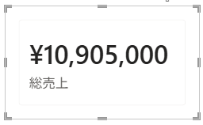

---

#### # AVERAGE関数

```sql
平均売上 =
AVERAGE('販売'[売上])
```

```sql
平均注文数量 =
AVERAGE('販売'[数量])
```

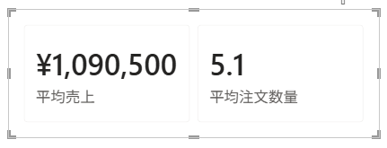

---

#### # MIN関数

```sql
最小売上 =
MIN('販売'[売上])
```

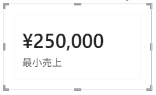

#### # MAX関数

```sql
最大売上 =
MAX('販売'[売上])
```

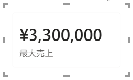

---

#### # COUNT関数

数値データの件数をカウントする。

```sql
数量件数 =
COUNT('販売'[数量])
```


#### # COUNTA関数

空白以外のセルをカウントする。

```sql
商品入力件数 =
COUNTA('販売'[商品])
```

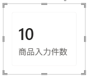

#### # COUNTROWS関数

テーブル全体の行数をカウントする。

```sql
注文件数 =
COUNTROWS('販売')
```


#### # DISTINCTCOUNT関数

重複を除いた値の件数をカウントする。

```sql
商品種類数 =
DISTINCTCOUNT('販売'[商品])
```


---

#### # MEDIAN関数

中央値を求める。

```sql
売上中央値 =
MEDIAN('販売'[売上])
```

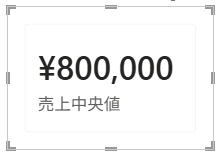

---

#### ※ メジャーから別のメジャーを作成

他のメジャーを参照する場合は、テーブル名を付けず `[メジャー名]` で記述する。

#### # DIVIDE関数

```sql
平均注文金額 =
DIVIDE(
    [総売上],
    [注文件数]
)
```

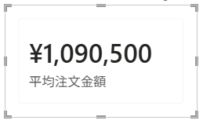

---

#### ※ メジャーとフィルターコンテキスト

- メジャーは、ビジュアルの行・列・フィルターによって作られる`フィルターコンテキスト`に応じて結果が変わる。
- `CALCULATE()`を使用すると、DAX式の中でフィルター条件を直接指定して計算できる。
- SQLと比較すると、通常のメジャーは`GROUP BY`なしの集計、`CALCULATE()`は条件を指定した集計に近い。

---

## 3. メジャー管理テーブルの作成

メジャーは行ごとの値としてデータビューに保存されないため、専用のテーブルにまとめて管理できる。

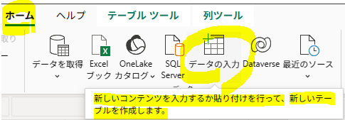

1. 「`ホーム`」→「`データの入力`」から `_メジャー` テーブルを作成する
2. 自動生成された不要な列は「`データ`」ペインで非表示にする

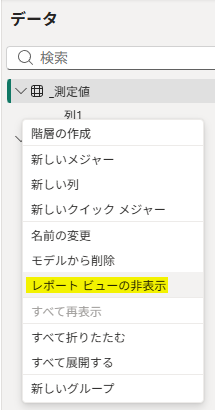

---

#### メジャーのホームテーブル変更

1. 「`データ`」ペインからメジャーを選択する
2. 「`メジャーツール`」→「`ホームテーブル`」を選択する
3. ホームテーブルを `_測定値` に変更する

#### - 結果

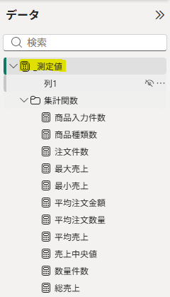