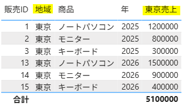
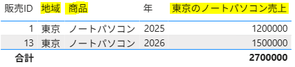
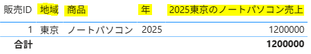
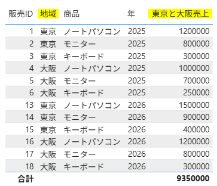
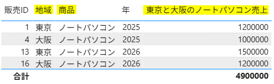

使用ファイル：`CALCULATE_JP.csv`


---

## 1. 新しいメジャーの追加

#### # SUM関数

```sql
総売上 =
SUM('販売'[売上])
```

## 2. CALCULATE()関数

`CALCULATE()`は、既存の計算式やメジャーの`フィルターコンテキストを変更して再計算する関数`。

#### # 基本構文

```sql
メジャー =
CALCULATE(
    [既存メジャー],
    条件1,
    条件2,
    条件3
)
```

#### 使用例)

```sqlD
東京売上 =
CALCULATE(
    [総売上],
    '販売'[地域] = "東京"
)
```

- 第1引数：**何を計算するか**を指定する  
  例：`[総売上]`

- 第2引数以降：**どの条件で計算するか**を指定する  
  例：`'販売'[地域] = "東京"`

<br>

---

※ `CALCULATE()`は、次の流れで計算される。

**① 既存のフィルターを確認 → ② CALCULATEのフィルターで変更・置換 → ③ 最終的な式を計算**

(SQLの`WHERE`句や`HAVING`句と似ている)

---

#### 1) 総売上メジャーを使用して東京の売上を求める

```sql
東京売上 =
CALCULATE(
    [総売上],
    '販売'[地域] = "東京"
)
```



`[総売上]` → 東京の条件を適用 → 東京のデータだけを対象にする → 総売上を計算

---

#### 2) 複数フィルター

#### - AND条件：`,` または `&&` を使用する

```sql
東京のノートパソコン売上 =
CALCULATE(
    [総売上],
    '販売'[地域] = "東京",
    '販売'[商品] = "ノートパソコン"
)
```



SQLで表すと、次の条件に相当する。

```sql
WHERE 地域 = '東京'
  AND 商品 = 'ノートパソコン'
```

---

`,` の代わりに `&&` で条件をつなぐこともできる。

```sql
東京のノートパソコン売上 =
CALCULATE(
    [総売上],
    '販売'[地域] = "東京" && '販売'[商品] = "ノートパソコン"
)
```

---

※ 複数のフィルター条件は、`&&` より`,`で分けて記述するほうが読みやすい。

```sql
2025東京のノートパソコン売上 =
CALCULATE(
    [総売上],
    '販売'[地域] = "東京",
    '販売'[商品] = "ノートパソコン",
    '販売'[年] = 2025
)
```



---

#### - OR条件

`||` を使用すると、いずれかの条件を満たすデータを対象にできる。

```sql
東京と大阪売上 =
CALCULATE(
    [総売上],
    '販売'[地域] = "東京" || '販売'[地域] = "大阪"
)
```



---

#### - AND・OR条件の組み合わせ

OR条件は `()` でまとめ、他の条件と組み合わせる。

```sql
東京と大阪のノートパソコン売上 =
CALCULATE(
    [総売上],
    ('販売'[地域] = "東京" || '販売'[地域] = "大阪"),
    '販売'[商品] = "ノートパソコン"
)
```

