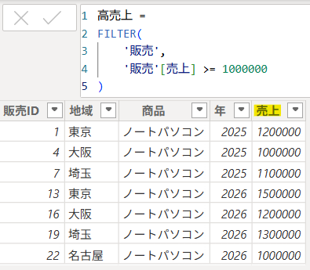
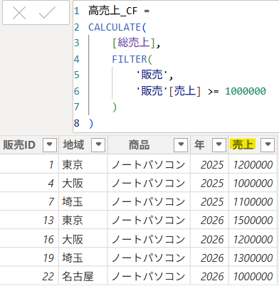
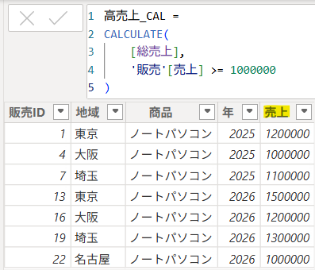
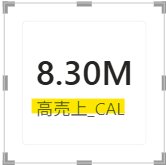
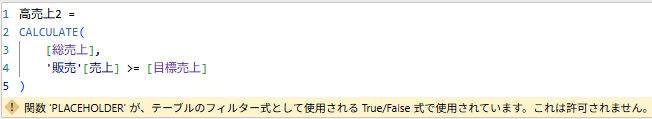
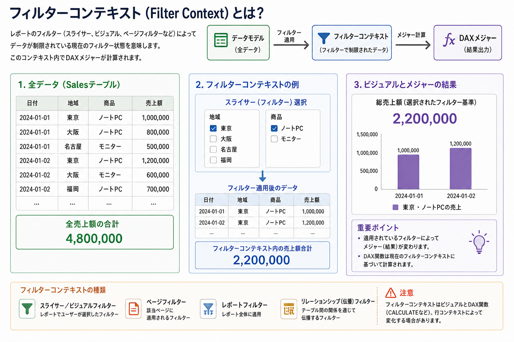
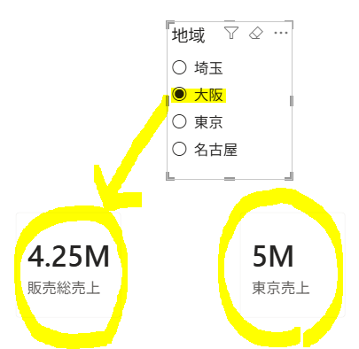
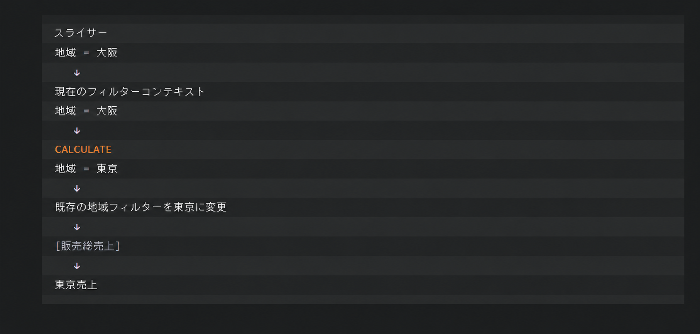

## 1. FILTER()

- `FILTER()`は、指定したテーブルから`条件に一致する行だけを抽出する関数`である。  
- SQLの`WHERE`句と似た役割を持つ。

#### # 基本構文

```sql
FILTER(
    テーブル,
    条件
)
```

#### 例：売上が100万以上の行を抽出

```sql
FILTER(
    '販売',
    '販売'[売上] >= 1000000
)
```



- `販売`テーブルを対象にする
- `[売上]`が`1,000,000`以上の行だけを抽出する
- `FILTER()`の結果は**条件に一致したテーブル**として返される

---

## 2. CALCULATE() + FILTER()

`FILTER()`で抽出した条件を`CALCULATE()`に適用して、条件付きの集計を行う。

#### 例：売上100万以上の総売上

```sql
高売上_CF =
CALCULATE(
    [総売上],
    FILTER(
        '販売',
        '販売'[売上] >= 1000000
    )
)
```

 

#### # 処理の流れ

1. `FILTER()`で`販売`テーブルから**売上100万以上の行**を抽出する
2. `CALCULATE()`がその条件をフィルターとして適用する
3. `[総売上]`を再計算する
4. 条件に一致した売上の合計が`[高売上]`として返される

---

上記のように、単純な固定値でフィルターする場合は、`FILTER`関数を使用せずに次のように記述できる。

```sql
高売上_CAL =
CALCULATE(
    [総売上],
    '販売'[売上] >= 1000000
)
```

 


- ただし、フィルターの比較対象が固定値ではない場合（別の列、メジャー、動的な変数など）は、`FILTER`関数を使用する必要がある。

- `CALCULATE`関数で直接表現できる単純なフィルターではなく、`各行の条件を評価する場合`は、`FILTER`関数を使用する。

---

#### - 目標売上メジャーの追加

```sql
目標売上 = 1000000
```

※ メジャーを直接使用するとエラー

```sql
高売上2 =
CALCULATE(
    [総売上],
    '販売'[売上] >= [目標売上]
)
```



- `[目標売上]`の計算結果は`1,000,000`で固定されていても、DAXではメジャーとして扱われるため、`CALCULATE()`のTrue/False形式のフィルター条件には直接使用できない。

▶ FILTER関数を使用して解決

```sql
高売上2 =
CALCULATE(
    [総売上],
    FILTER(
        '販売',
        '販売'[売上] >= [目標売上]
    )
)
```

- `FILTER()`は各行で`[売上]`と`[目標売上]`を比較し、条件に一致するテーブルを返す。
- `CALCULATE()`はそのテーブルをフィルターとして受け取るため、エラーが発生しない。

---

※ 慣れるまでは`CALCULATE`関数と`FILTER`関数を併用する。<br>慣れてきたら、単純な条件の場合は`FILTER`関数を省略できる。

例）

```sql
東京高売上 =
CALCULATE(
    [総売上],
    '販売'[地域] = "東京",
    '販売'[売上] >= 1000000
)
```

または

```sql
東京高売上 =
CALCULATE(
    [総売上],
    '販売'[地域] = "東京"
    &&
    '販売'[売上] >= 1000000
)
```

または

```sql
東京高売上 =
CALCULATE(
    [総売上],
    FILTER(
        '販売',
        '販売'[地域] = "東京"
        &&
        '販売'[売上] >= 1000000
    )
)
```

---

## 3. フィルターコンテキスト

フィルターコンテキスト（Filter Context）は、Power BIとDAX（Data Analysis Expressions）における最も重要な概念の一つであり、`数式を計算するときに、どのデータ（行）を対象にするかを決定するフィルター条件の集合（環境）`を意味する。



※ DAXによるフィルターコンテキストの操作

フィルターコンテキストは、通常、スライサーやビジュアルによって決定されるが、DAXの数式で動的に変更することもできる。

- `CALCULATE()`：既存のフィルターコンテキストに新しい条件を追加するか、既存の条件を上書きする。
- `ALL()`：既存のフィルターコンテキストを削除する。
- `ALLEXCEPT()`：指定した列を除く、すべてのフィルターコンテキストを削除する。

---

次のビジュアルでは、スライサーで地域を変更しても「東京売上」のカードは変化しない。



- スライサーで「大阪」を選択すると、通常は大阪のフィルターが適用される。
- しかし、`CALCULATE()`が同じ地域列に「東京」という条件を指定するため、既存の地域フィルターが東京に上書きされる。

