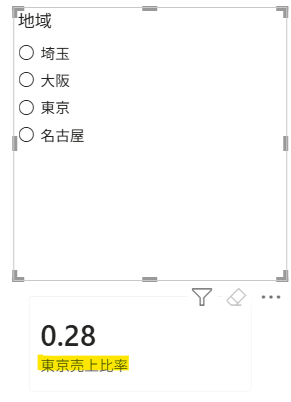
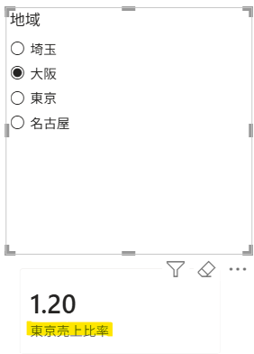
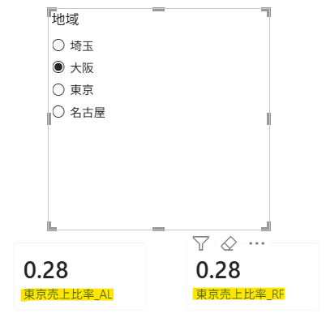
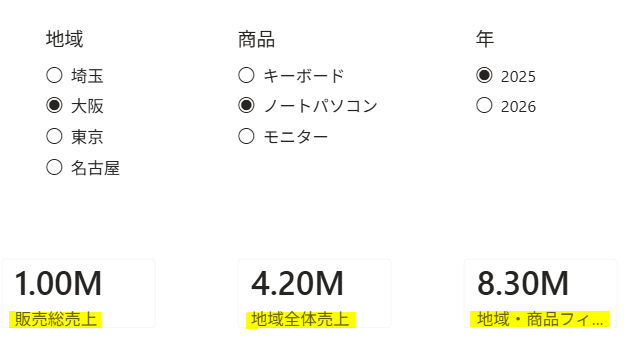
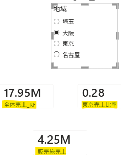
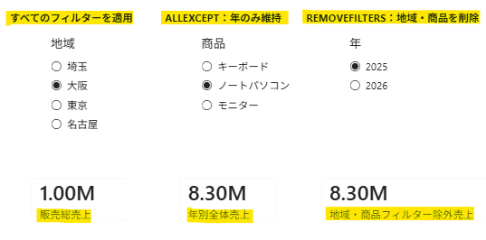
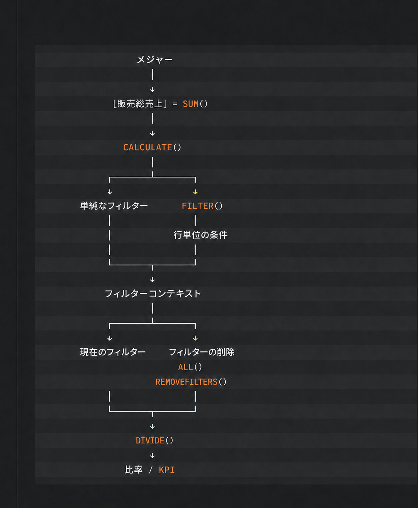

## 1. `ALL()`関数、`REMOVEFILTERS()`関数

- `FILTER()`は、条件に一致する行だけを含むテーブルを返す。
- `CALCULATE()`は、指定したフィルターを追加し、同じ列に既存のフィルターがある場合は上書きして計算する。
- `ALL()`関数と`REMOVEFILTERS()`関数は、指定したテーブルや列のフィルターを解除するために使用する。

---

新しいメジャーの追加

東京売上が全体売上に占める割合は？

```sql
東京売上比率 =
DIVIDE(
    [東京売上],
    [販売総売上]
)
```





#### ! スライサーによるフィルターの問題

- `[販売総売上]`にはスライサーのフィルターコンテキストが適用されるため、本来約`0.28`になる東京売上比率が、選択した地域によって変化する。
- 例えば大阪を選択すると、`[東京売上] ÷ [大阪売上]`となり、結果が`1.20`になる。
- 全体売上に対する割合を求めるには、分母にスライサーの影響を受けない全体売上を使用する必要がある。

---

#### 固定した全体売上メジャーの追加

`ALL()`を使用する場合：

```sql
全体売上_AL =
CALCULATE(
    [販売総売上],
    ALL('販売')
)
```

または、`REMOVEFILTERS()`を使用する場合：

```sql
全体売上_RF =
CALCULATE(
    [販売総売上],
    REMOVEFILTERS('販売')
)
```




- `ALL('販売')`：`販売`テーブルに適用されたフィルターを無視し、すべての行を計算対象にする。
- `REMOVEFILTERS('販売')`：`販売`テーブルに適用されたフィルターを削除する。
- この例では、どちらを使用しても同じ全体売上が求められる。

---

#### ※ `ALL()`と`REMOVEFILTERS()`の違い

- `ALL()`は、適用されているフィルターを無視して、すべてのデータを計算対象にする。

- `REMOVEFILTERS()`は、適用されているフィルターを取り除くために使用する。

---

#### # `REMOVEFILTERS()`は、テーブル全体だけでなく、指定した列のフィルターだけを削除することもできる。

#### - 特定の列のフィルターを削除

```sql
地域全体売上 =
CALCULATE(
    [販売総売上],
    REMOVEFILTERS('販売'[地域])
)
```

この場合、`地域`のフィルターだけが削除され、`年`や`商品`など、ほかの列のフィルターは維持される。


#### - 複数の列のフィルターを削除

```sql
地域・商品フィルター除外売上 =
CALCULATE(
    [販売総売上],
    REMOVEFILTERS(
        '販売'[地域],
        '販売'[商品]
    )
)
```

この場合、`地域`と`商品`のフィルターが削除され、それ以外の列のフィルターは維持される。

#### 比較



スライサーで「地域：大阪」「商品：ノートパソコン」「年：2025」を選択した場合：

- `[販売総売上]`：大阪における2025年のノートパソコン売上（1.00M）
- `[地域全体売上]`：地域フィルターを削除し、すべての地域における2025年のノートパソコン売上（4.20M）
- `[地域・商品フィルター除外売上]`：地域と商品のフィルターを削除し、すべての地域・商品の2025年売上（8.30M）

---

#### 東京売上比率の修正

```sql
東京売上比率 =
DIVIDE(
    [東京売上],
    [全体売上_RF]
)
```



スライサーで「大阪」を選択した場合：

- `[全体売上_RF]`：地域フィルターの影響を受けない全体売上（`17.95M`）
- `[東京売上比率]`：東京売上`5.10M`を全体売上`17.95M`で割った値（`0.28`）
- `[販売総売上]`：大阪の売上（`4.25M`）

地域スライサーを変更しても、全体売上と東京売上比率は変化しない。

---

## 2. `ALLEXCEPT()`関数

`年`列のフィルターだけを残す場合は、`ALLEXCEPT()`を使用する。

```sql
年別全体売上 =
CALCULATE(
    [販売総売上],
    ALLEXCEPT(
        '販売',
        '販売'[年]
    )
)
```


- `年`フィルターだけを維持し、`地域`や`商品`など、ほかの列のフィルターを削除する。

---

## 3. `FILTER()`・`ALL()`・`ALLEXCEPT()`・`REMOVEFILTERS()`の比較

| 関数                | 主な役割                    | 既存のフィルター          | 主な使用目的              | 例                                   |
| ----------------- | ----------------------- | ----------------- | ------------------- | ----------------------------------- |
| `FILTER()`        | 条件に一致する行を抽出する           | 基になるテーブルのフィルターを反映 | 複雑な条件による絞り込み        | `FILTER('販売', '販売'[売上] >= 1000000)` |
| `ALL()`           | 指定したテーブルまたは列のフィルターを無視する | 削除                | 全体を基準とした計算          | `ALL('販売')`                         |
| `ALLEXCEPT()`     | 指定した列以外のフィルターを削除する      | 指定した列だけ維持         | 特定の項目を基準とした集計       | `ALLEXCEPT('販売', '販売'[年])`          |
| `REMOVEFILTERS()` | 指定したフィルターを削除する          | 指定したフィルターを削除      | 特定のテーブルまたは列のフィルター削除 | `REMOVEFILTERS('販売'[地域])`           |

---

## 4. 測定値にフィルターコンテキストが適用される全体の流れを視覚化すると···


