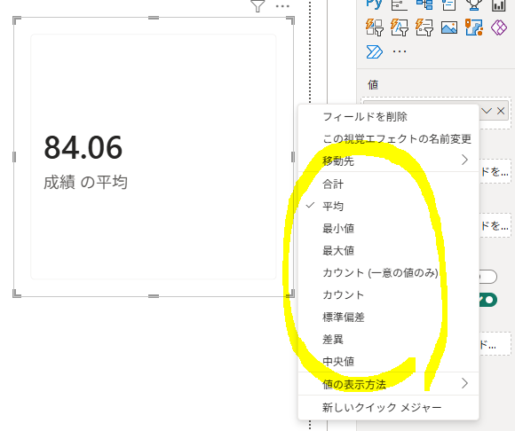
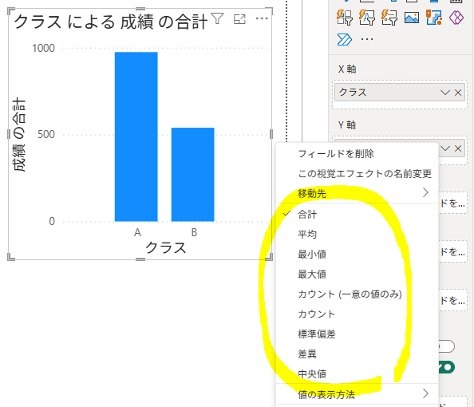

## 1. Power BIのビジュアルは自動的に集計する

- Power BIでは、数値列をビジュアルに配置すると、合計・平均・最小値・最大値・個数などが自動的に計算される。
- そのため、単純な集計ではDAXメジャーを作成する必要がない。

| ビジュアル | フィールドの配置        | Power BIの処理     |
| ----- | --------------- | --------------- |
| カード   | 成績 → 値          | 合計や平均など、1つの値に集計 |
| 棒グラフ  | 科目 → X軸、成績 → Y軸 | 科目別に成績を集計       |
| テーブル  | 学生名、成績          | 学生ごとの成績を表示      |
| 円グラフ  | 科目 → 凡例、成績 → 値  | 科目別に成績を集計       |

---

#### [Power BIビジュアルの自動集計の流れ]

```text
数値列
  ↓
ビジュアルに配置
  ↓
Power BIが自動集計
  ↓
合計・平均・最小値・最大値・個数
  ↓
新しいメジャーは不要

────────────

単純な集計では対応できない
  ↓
計算式・フィルター条件が必要
  ↓
新しいメジャーを作成
  ↓
DAX
```
---

## 2. 実習

#### 1) カードで自動集計を確認

- 「`視覚化`」→「`カード`」を選択する。
- `成績`をカードの「値」に配置する。
- `成績`列には18件の値があるが、カードには自動集計された1つの値が表示される。
- `成績`フィールドの右側にある「▼」から、平均・最小値・最大値・カウントなどに変更できる。

※ 選択肢にない集計が必要な場合は、「**新しいメジャー**」からDAXメジャーを作成する。



---

#### 2) 棒グラフで自動集計を確認

- 「`視覚化`」→「`縦棒グラフ`」を選択する。
- `科目`をX軸、`成績`をY軸に配置する。
- Power BIが科目ごとに`成績`を自動集計する。



---

## 3. 「新しいメジャー」が必要な場合

- 平均・最小値・最大値・カウントなどの基本集計は、メジャーを作成しなくても使用できる。
- それ以外の計算には、新しいメジャーが必要となる。

例：

- 合格率
- 前年比増減率
- 全体平均との差
- 売上比率
- 上位10％
- クラス別の成績
- フィルターを無視した全体平均