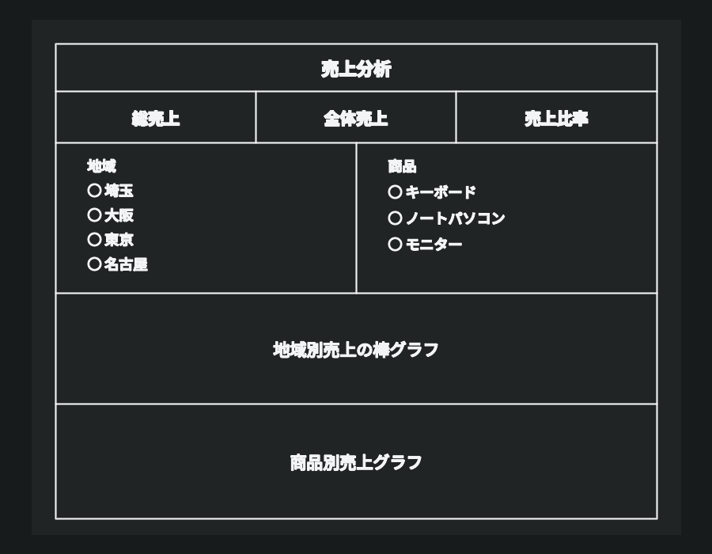
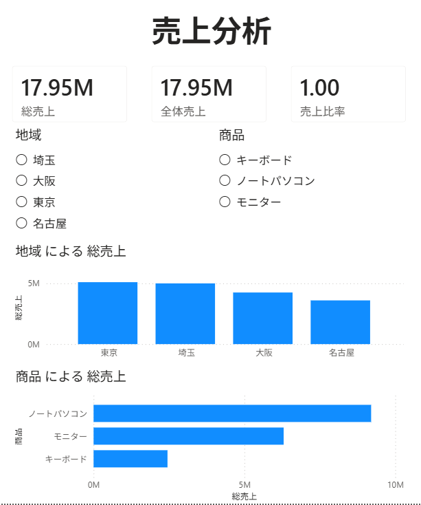
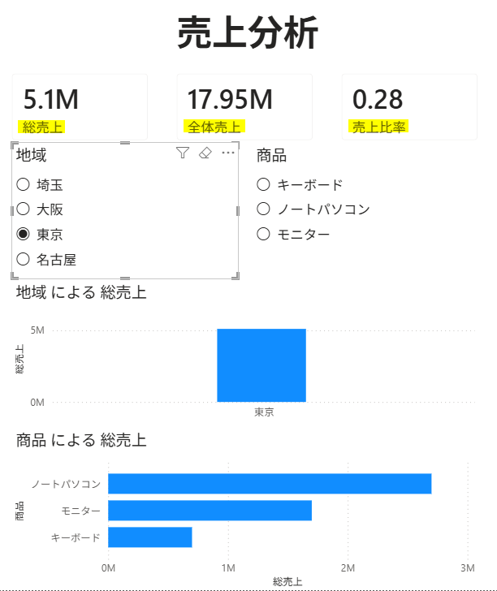

使用ファイル：`販売_JP.csv`

---

[レポート]



---

[メジャー]

```sql
総売上 =
SUM('販売'[売上])
```

```sql
全体売上 =
CALCULATE(
    [総売上],
    REMOVEFILTERS('販売')
)
```

```sql
売上比率 =
DIVIDE(
    [総売上],
    [全体売上],
    0
)
```

---

<br>

| レポート領域 | 使用するメジャー／フィールド |
|---|---|
| カード① | `[総売上]` |
| カード② | `[全体売上]` |
| カード③ | `[売上比率]` |
| 地域別棒グラフ | 軸：`'販売'[地域]`／値：`[総売上]` |
| 商品別グラフ | 軸：`'販売'[商品]`／値：`[総売上]` |
| 地域スライサー | `'販売'[地域]` |
| 商品スライサー | `'販売'[商品]` |

---

#### - 結果



---

<br>

- スライサーで東京を選択すると、`[総売上]`、地域別グラフ、商品別グラフは東京のデータに絞り込まれるが、`[全体売上]`は変化しない。
- そのため、`[売上比率]`には全体売上に対する現在選択中の条件の売上割合が表示される。

