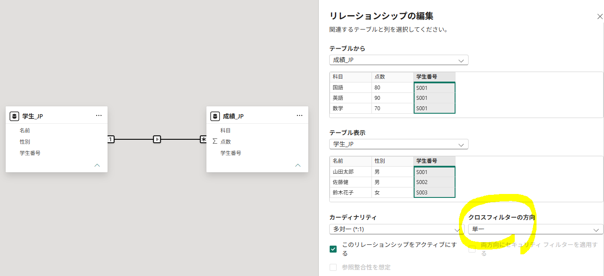
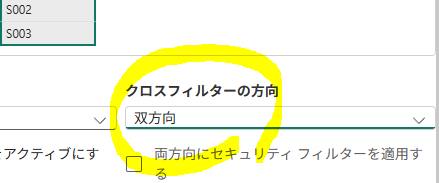
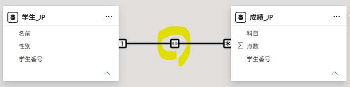
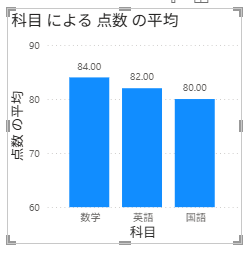
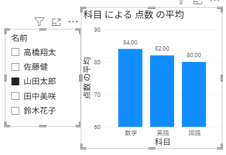
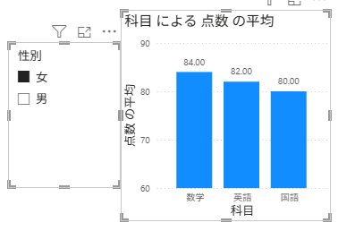
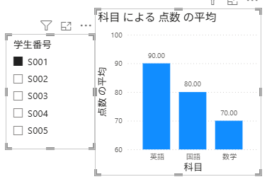
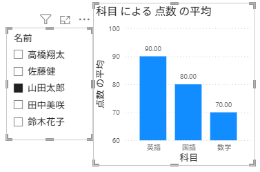
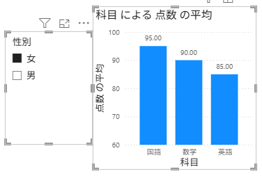

## 1. CSVファイル

#### 学生.csv

```csv
学生番号,名前,性別
S001,ホン・ギルドン,男
S002,キム・チョルス,男
S003,イ・ヨンヒ,女
S004,パク・ミンス,男
S005,チェ・スジン,女
```

#### 成績.csv

```csv
学生番号,科目,点数
S001,国語,80
S001,英語,90
S001,数学,70
S002,国語,70
S002,英語,80
S002,数学,90
S003,国語,90
S003,英語,80
S003,数学,100
S004,国語,60
S004,英語,70
S004,数学,80
S005,国語,100
S005,英語,90
S005,数学,80
```

---

## 2. フィルターコンテキストの伝播

リレーションシップがない場合：

```text
［学生のフィルターコンテキスト］  ［成績のフィルターコンテキスト］
               └──── リレーションシップなし ────┘
```

リレーションシップがある場合：

- `フィルター`は`親テーブル`から`子テーブル`へ伝播する。
- 子テーブルから親テーブルへの伝播も可能にするには、リレーションシップ設定でクロスフィルターの方向を「`両方向`」に設定する。

```text
［学生のフィルターコンテキスト］
                │
                │ フィルターの伝播
                ▼
［成績のフィルターコンテキスト］
                │
                ▼
        メジャーの再計算
```

#### ▶ フィルターの伝播が単方向：親 → 子




#### ▶ フィルター伝播が双方向：親 ⇔ 子





---

## 3. フィルターコンテキストの実習

#### STEP 1. 2つのテーブルを読み込む

```text
学生.csv  
成績.csv
```

#### STEP 2. リレーションシップを設定しない

```text
学生 ― ✕ ― 成績
```

#### STEP 3. 棒グラフを作成する

科目 → X軸  
成績 → Y軸  
集計 → 平均



---

#### STEP 4. リレーションシップ設定前の確認

- `学生[名前]`をスライサーに追加
- `山田太郎`を選択



-> グラフは変化しない

---
<br>

- `学生[性別]`をスライサーに追加
- `女`を選択



-> グラフは変化しない

→ リレーションシップがないため、`学生`テーブルのフィルターは`成績`テーブルに伝播しない。

---
<br>

- `成績[学生番号]`をスライサーに追加
- `S001`を選択



-> グラフが変化する

→ 同じ`成績`テーブル内では、スライサーのフィルターが適用される。

---

#### STEP 5. リレーションシップを設定

`学生[学生番号]` 1 ─── * `成績[学生番号]`

---

#### STEP 6. リレーションシップ設定後の確認

- `学生[名前]`で`山田太郎`を選択



-> グラフが変化する

---
<br>

- `学生[性別]`で`女`を選択



-> グラフが変化する

→ リレーションシップを通して、`学生`テーブルのフィルターが`成績`テーブルに伝播する。

> 各確認の前に、前のスライサーの選択を解除する。

---

#### # フィルターコンテキストの流れ

```text
スライサー
    ↓
フィルターコンテキストを生成
    ↓
対象のテーブルにフィルターを適用
    ↓
リレーションシップを通して
別のテーブルへフィルターを伝播
    ↓
メジャー・集計値を再計算
    ↓
ビジュアルが変化
```

> リレーションシップがない場合、フィルターは別のテーブルに伝播しない。