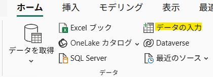
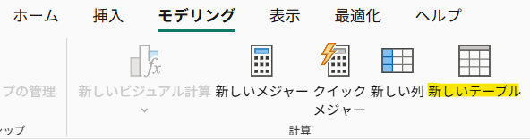
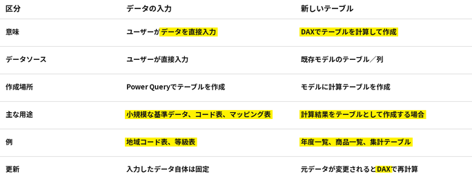
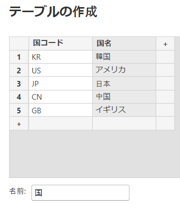

## 1. 2つの方法でテーブルを作成する

#### 1) データの入力

自分でデータを入力してテーブルを作成する。



```text
少量のデータを直接入力
        ↓
［データの入力］
        ↓
テーブルを作成
```

#### 2) 新しいテーブル

DAX式を使用して新しいテーブルを作成する。



```text
既存のデータを使用して
DAX式で新しいテーブルを計算
        ↓
［新しいテーブル］
        ↓
テーブルを作成
```

#### ※ 違い



---

## 2. 実習

#### 1) テーブル表示 → ホーム → データ入力




#### 2) テーブルの表示 → ホーム → 新しいテーブルまたはテーブルツール → 新しいテーブル

```SQL
年表 = CALENDAR(DATE(2024,1,1), DATE(2026,12,31))
```

#### 2) `CALENDAR()`で日付テーブルを作成

`テーブルビュー → モデリング → 新しいテーブル`

```dax
年テーブル =
CALENDAR(
    DATE(2024, 1, 1),
    DATE(2026, 12, 31)
)
```

- `2024年1月1日`から`2026年12月31日`までの連続した日付を持つテーブルを作成する。

---