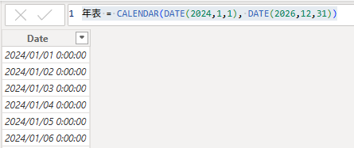
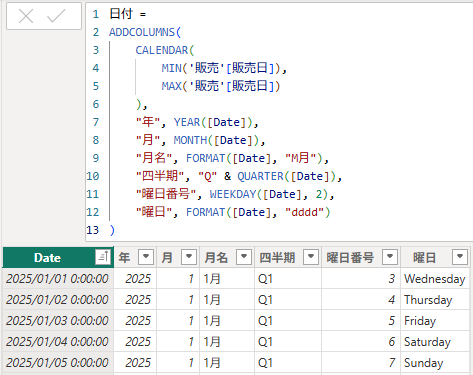
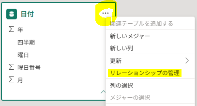
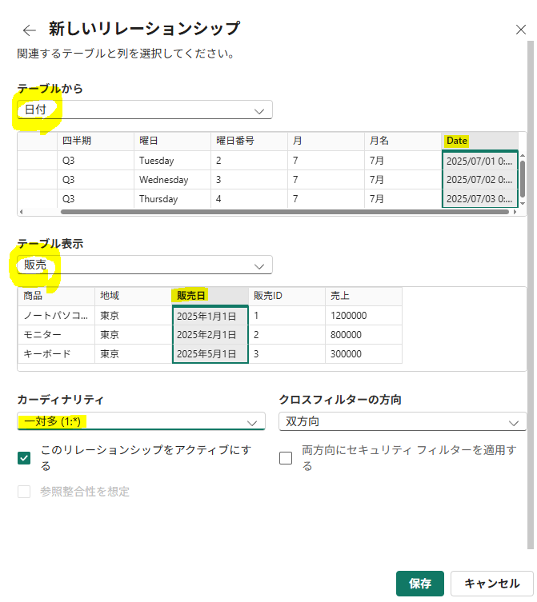
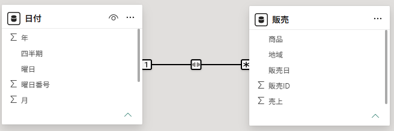

## 1. 2つの方法でテーブルを作成する

#### 1) データの入力

自分でデータを入力してテーブルを作成する。


```text
少量のデータを直接入力
        ↓
［データの入力］
        ↓
テーブルを作成
```

#### 2) 新しいテーブル

DAX式を使用して新しいテーブルを作成する。


```text
既存のデータを使用して
DAX式で新しいテーブルを計算
        ↓
［新しいテーブル］
        ↓
テーブルを作成
```

#### ※ 違い


---

## 2. 実習

#### 1) データ入力でテーブルを作成

`テーブルビュー → ホーム → データ入力`


---

#### 2) `CALENDAR()`で日付テーブルを作成

`テーブルビュー → モデリング → 新しいテーブル`

```SQL
年表 = CALENDAR(DATE(2024,1,1), DATE(2026,12,31))
```




- `2024年1月1日`から`2026年12月31日`までの連続した日付を持つテーブルを作成する。

---

#### 3) 既存テーブルの日付列から新しいテーブルを作成

`テーブルビュー → モデリング → 新しいテーブル`

```sql
日付 =
ADDCOLUMNS(
    CALENDAR(
        MIN('販売'[販売日]),
        MAX('販売'[販売日])
    ),
    "年", YEAR([Date]),
    "月", MONTH([Date]),
    "月名", FORMAT([Date], "M月"),
    "四半期", "Q" & QUARTER([Date]),
    "曜日番号", WEEKDAY([Date], 2),
    "曜日", FORMAT([Date], "dddd")
)
```



- `販売[販売日]`の最小日付から最大日付までの日付テーブルを作成する。
- 年・月・月名・四半期・曜日番号・曜日の列を追加する。

---

#### モデルビューで1対多のリレーションシップを設定

```text
日付[Date]  1 ───────── *  販売[販売日]
```





#### - 結果



<br>

-> 日付テーブルを追加して`リレーションシップを設定`すると、`レポートのビジュアル`で年・月・四半期・曜日別に売上を分析できる