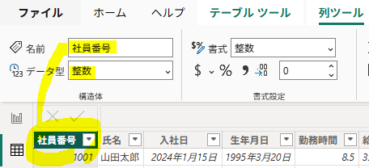
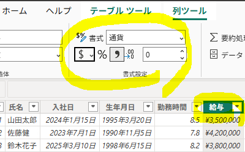
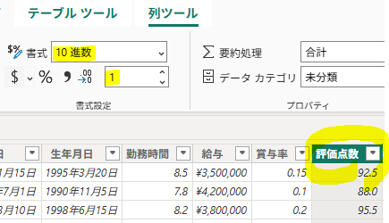
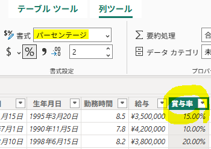
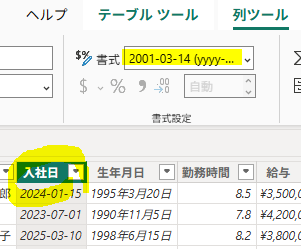
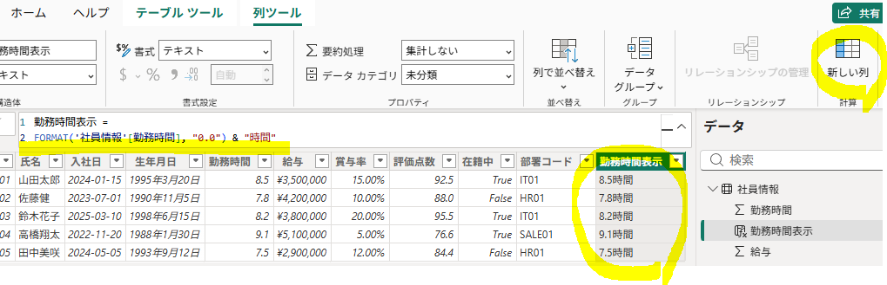

使用ファイル：`employee_JP.csv`

---

## 1. CSV

```csv
社員番号,氏名,入社日,生年月日,勤務時間,給与,賞与率,評価点数,在籍中,部署コード
1001,山田太郎,2024-01-15,1995-03-20,8.5,3500000,0.15,92.54,true,IT01
1002,佐藤健,2023-07-01,1990-11-05,7.8,4200000,0.10,88.01,false,HR01
1003,鈴木花子,2025-03-10,1998-06-15,8.2,3800000,0.20,95.51,true,IT01
1004,高橋翔太,2022-11-20,1988-01-30,9.1,5100000,0.05,76.59,true,SALE01
1005,田中美咲,2024-05-05,1993-09-12,7.5,2900000,0.12,84.44,false,HR01
```

## 2. 列ごとのデータ型・表示形式の設定

| 列 | 元のデータ | Power BIのデータ型 | 設定する表示形式 |
|---|---:|---|---|
| 社員番号 | 1001 | 整数 | `1001` |
| 氏名 | 山田太郎 | テキスト | テキスト |
| 入社日 | 2024-01-15 | 日付 | `2024-01-15`、`2024年1月15日` |
| 生年月日 | 1995-03-20 | 日付 | 日付 |
| 勤務時間 | 8.5 | 10進数 | `8.5時間` |
| 給与 | 3500000 | 整数 | `¥3,500,000` |
| 賞与率 | 0.15 | 10進数 | `15.00%` |
| 評価点数 | 92.54 | 10進数 | `92.5点` |
| 在籍中 | true | True/False | `True / False` |
| 部署コード | IT01 | テキスト | テキスト |

## 3. データ型・表示形式の変更

- データ型：テーブルビュー → 列を選択 → 列ツール → データ型
- 表示形式：テーブルビュー → 列を選択 → 列ツール → 書式



```text
社員番号　→ 整数
氏名　　　→ テキスト
入社日　　→ 日付
生年月日　→ 日付
勤務時間　→ 10進数
給与　　　→ 整数
賞与率　　→ 10進数
評価点数　→ 10進数
在籍中　　→ True/False
部署コード → テキスト
```

---

## 4. 表示形式の変更

#### 1) 通貨形式

`給与`列を選択し、表示形式を `「¥3,500,000」` の形式に変更する。



#### 2) 小数点以下の桁数

`評価点数`列を選択し、小数点以下の桁数を `「1」` に設定する。



#### 3) パーセンテージ形式

`賞与率`列を選択し、表示形式を `「パーセンテージ」` に変更する。



#### 4) 日付形式

`入社日`列を選択し、日付の表示形式を `「2024-01-15」` に変更する。



#### 5) ユーザー定義の表示形式

`勤務時間`を `「8.5時間」` の形式で表示するため、`勤務時間表示`列を追加する。

`テーブルツール → 新しい列`

```sql
勤務時間表示 =
FORMAT('社員情報'[勤務時間], "0.0") & "時間"
```

