## 1. データ可視化の目的

#### 1) レポート用

`「何が起きたのか？」`を確認し、意思決定に活用する。

#### 2) 分析用

`「なぜそのパターンが現れたのか？」`  
`「データにはどのような特徴があるのか？」`などを分析する。

```text
- データにはどのようなパターンがあるか
- 変数間に関係があるか
- 外れ値があるか
- データはどのように分布しているか
```

※ `Power BI`は主に`レポート作成`に適したツールである。  
- 散布図は標準機能として使用できるが、箱ひげ図やヒストグラムなどは、カスタムビジュアルが必要になる場合がある。  
- `詳細なデータ分析`には、`Pythonの分析・可視化ライブラリ`を使用するとよい。

---

## 2. Pythonビジュアルの使用

`Power BI`では、`レポート`上で`Pythonスクリプト`を実行して`グラフ`を作成できる。

#### # 設定方法

- `ファイル → オプションと設定 → オプション → Pythonスクリプト`

- 設定後、Power BIを再起動する

- 必要なライブラリはターミナルからインストールする

#### # Anacondaを使用する場合

- `Anaconda Prompt`を起動し、必要なライブラリをインストールする。

```bash
pip install pandas matplotlib seaborn
```

#### # Pythonビジュアルの動作確認

- Power BIの「視覚化」から`Pythonビジュアル`を選択する。

- 任意のデータフィールドを1つ追加し、Pythonスクリプトエディターに以下のコードを入力して実行する。

```python
import pandas as pd
import matplotlib.pyplot as plt
import seaborn as sns

plt.plot([10, 20, 15, 30, 25])
plt.show()
```

##### - 結果

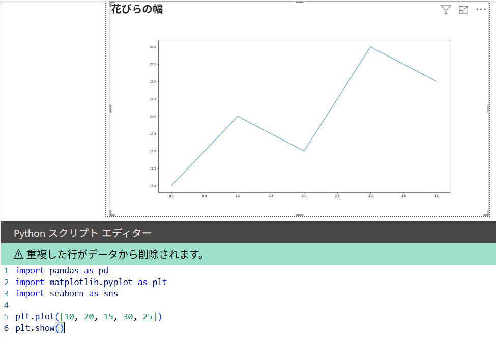

---

#### 4) 分析目的別のおすすめグラフ

| **分析目的** | **主な質問・確認事項** | **おすすめのグラフ** |
|---|---|---|
| **時系列分析** | 時間の経過による`傾向・増減・季節性`を確認する | **折れ線グラフ**（Line Chart） |
| **カテゴリ別比較** | どの`グループ・地域`が最も大きいか比較する | **棒グラフ**（Bar Chart） |
| **2変数の関係** | 2つの変数に`関連性`があるか確認する | **散布図**（Scatter Plot） |
| **相関分析** | 変数間の`正・負の関係と強さ`を確認する | **散布図＋トレンドライン**（相関係数） |
| **分布分析** | データが`どこに集中しているか`確認する | **ヒストグラム**（Histogram） |
| **四分位分析** | `中央値・Q1・Q3・ばらつき`を確認する | **箱ひげ図**（Box Plot） |
| **外れ値分析** | データに`外れ値`があるか確認する | **箱ひげ図／散布図** |
| **構成比分析** | 各項目が全体に占める`割合`を確認する | **棒グラフ／ドーナツグラフ** |
| **ランキング分析** | `上位・下位項目`を確認する（Top N／Bottom N） | **棒グラフ** |
| **累積変化** | 時間に伴う`構成の変化・累積量`を確認する | **積み上げ棒グラフ／面グラフ** |
| **変数別パターン** | 行・列の条件による`値のパターン`を確認する | **ヒートマップ**（Heatmap） |
| **地域分析** | データが発生した`地域・空間分布`を確認する | **マップ**（Map） |
| **目標達成度** | `目標を達成したか`確認する | **ゲージ／KPIカード** |

---

## 2. Power BIでのデータ分析・可視化実習

ここからは、上記の基準をもとに、`分析目的に合ったビジュアルをPower BIで作成し、結果を解釈する。`

---

#### ページ1：時系列分析 → 折れ線グラフ

`株価.csv`を使用する。

```text
X軸：日付
Y軸：株価（集計方法：合計）
凡例：銘柄
```

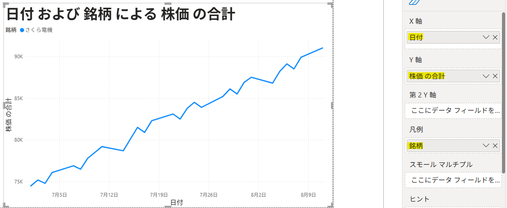

##### 【確認するポイント】

- **上昇傾向**
- **下降傾向**
- **急激な増加**
- **急激な減少**
- **季節性**
- **特定時点における異常な変化**

---

#### ページ2：地域比較 → 棒グラフ

`売上.csv`を使用する。

```text
X軸：地域
Y軸：売上（集計方法：合計）
```

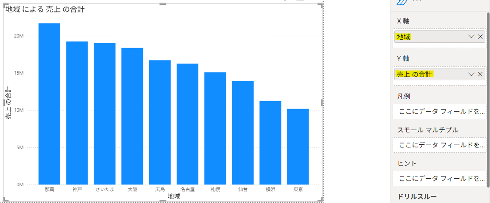

---

#### ページ3：変数間の関係 → 散布図

##### 1) 変数間の関係

`売上.csv`を使用する。

```text
X軸：広告費
Y軸：売上（集計方法：合計） 
```

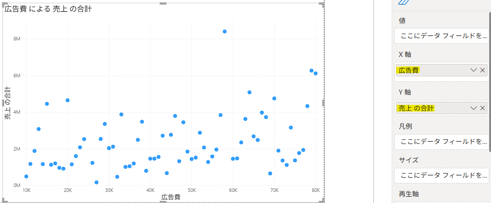


- 散布図は単に点を表示するだけでなく、**2つの変数間にある関係やパターン**を確認するために使用する。

- `広告費`が増えるほど`売上`も増える方向に点が分布していれば、両者には**正の相関関係**があると解釈できる。

> ただし、上の例では**広告費と売上の間に明確な関係は見られない。**

##### 2) 分類

`アヤメ.csv`を使用する。

```text
X軸：花びらの長さ
Y軸：花びらの幅
```

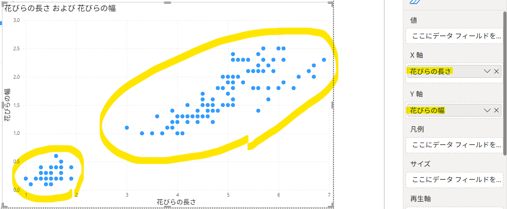

##### 【分析結果】

- 点は無作為に散らばっているのではなく、`複数のまとまり（クラスター）`を形成している。
- `花びらの長さ`が増えるほど`花びらの幅`も増える傾向があり、2つの変数には`正の相関関係`がある。
- 点が複数のクラスターに分かれているため、`品種によって花びらの大きさに特徴がある`ことも確認できる。

<BR>
- 凡例に`品種`を追加すると、次の3種類を色で区別できる。

```text
セトサ
バーシカラー
バージニカ
```

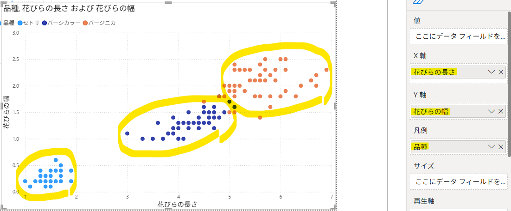

---

#### ページ4：構成比分析 → ドーナツグラフ

##### ※ 棒グラフとの違い

- `棒グラフ`：項目間の大きさを比較する
- `ドーナツグラフ`：各項目が全体に占める割合を確認する

`売上.csv`を使用する。

```text
凡例：上品
値：平均売上
```

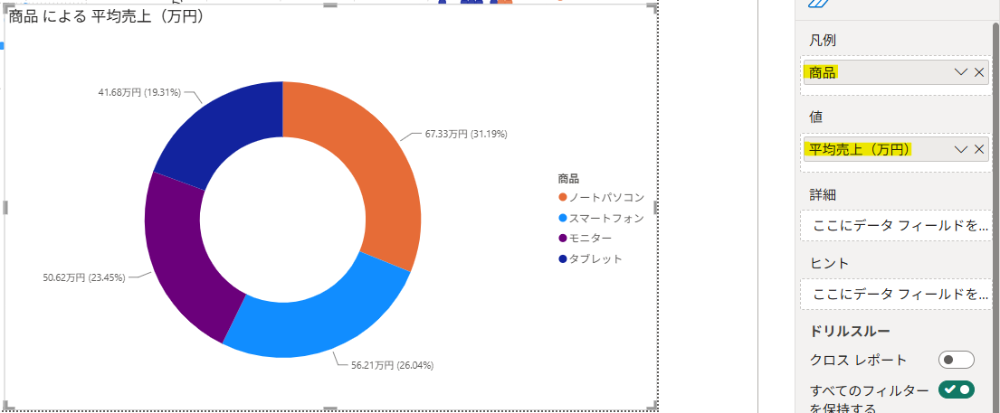


---

#### ページ5：地域・空間分析 → マップ

##### ※ マップビジュアルを有効にする

- `ファイル → オプションと設定 → オプション → セキュリティ`

- `「マップおよび塗り分け地図のビジュアルを使用する」`にチェックを入れる。

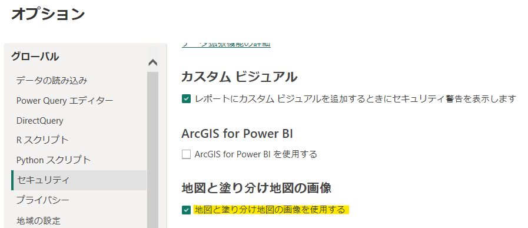

<br>

`売上.csv`を使用する。

```text
緯度：緯度
経度：経度
バブルサイズ：売上
```

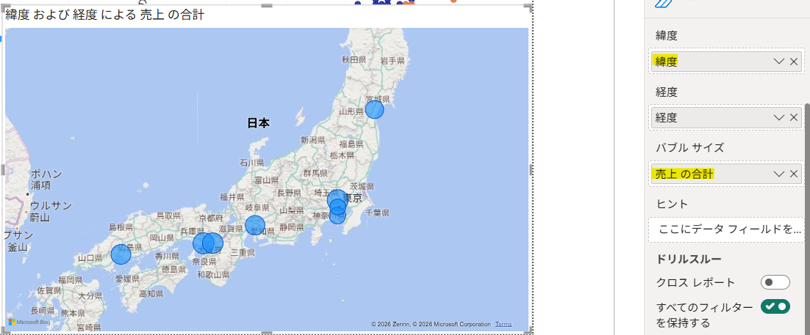

<br>

- `緯度`と`経度`の代わりに、`地域`を「場所」に設定することもできる。

- `地域`スライサーを追加し、選択した地域に合わせてマップがフィルターされることを確認する。

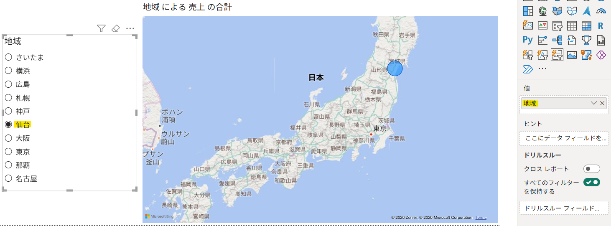

---

#### ページ6：分布分析 → ヒストグラム

Power BIには標準のヒストグラムがないため、`集合縦棒グラフとビン`を使用して同様のグラフを作成する。

`売上.csv`を使用する。

##### ※ ビンの作成

- `テーブルビュー → データペイン → 広告費を右クリック → 新しいグループ`

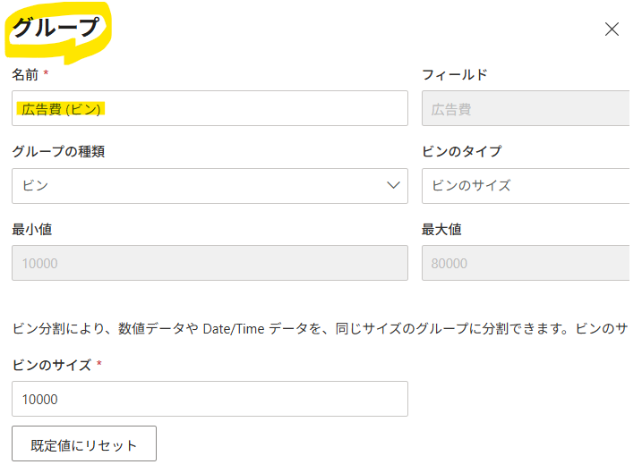

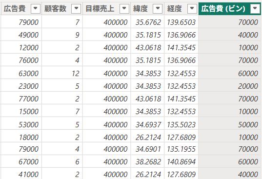

<br>

#### - ヒストグラムによる可視化結果

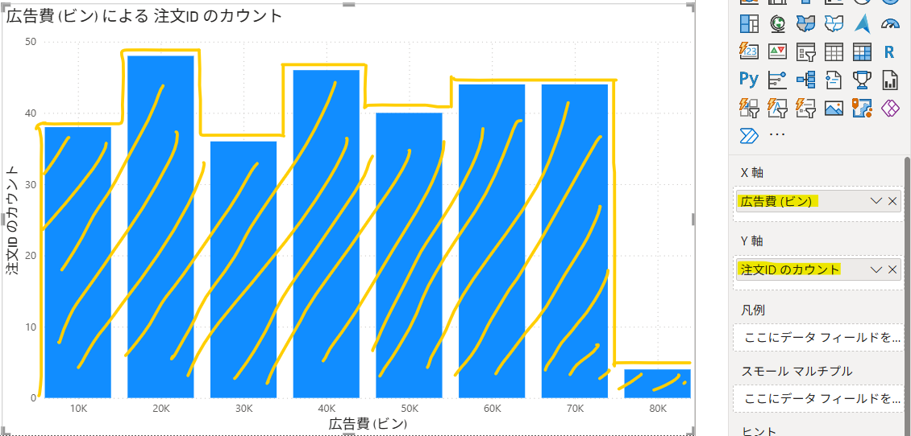

---

#### ページ7：四分位分析 → 箱ひげ図（Box Plot）

`アヤメ.csv`を使用する。

Power BIには箱ひげ図が標準搭載されていないため、`Pythonビジュアル`を使用して作成する。

##### Pythonスクリプト

```python
import seaborn as sns
import matplotlib.pyplot as plt

# 日本語の文字化けを防止
plt.rcParams["font.family"] = "Yu Gothic"
plt.rcParams["axes.unicode_minus"] = False

plt.figure(figsize=(12, 7))

# 品種別に、がく片の長さの箱ひげ図を作成
sns.boxplot(
    x="品種",
    y="がく片の長さ",
    hue="品種",
    data=dataset,
    palette="Set2",
    legend=False
)

plt.xlabel("品種")
plt.ylabel("がく片の長さ（cm）")
plt.title("品種別のがく片の長さの分布")
plt.tight_layout()
plt.show()
```

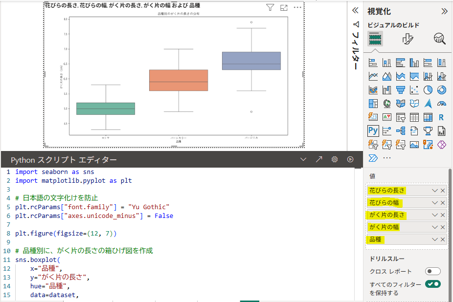

#### [解釈]

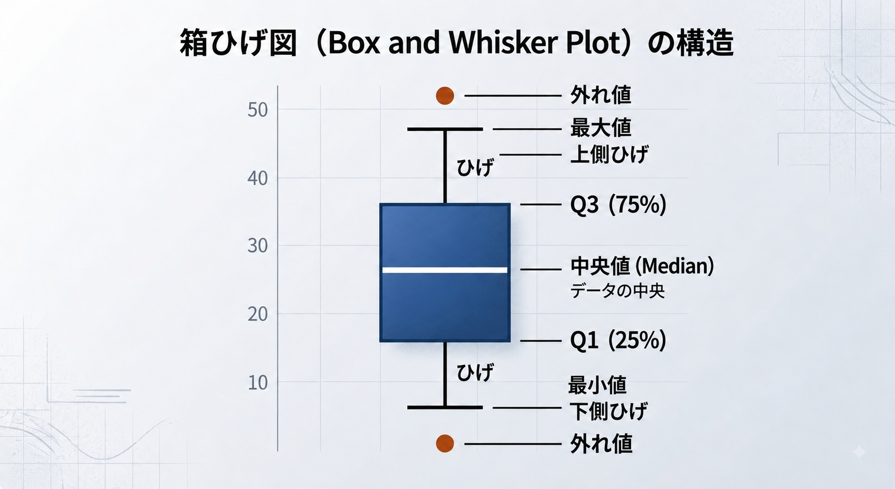

- **箱の下端（Q1）**：データの下位`25％`に位置する値
- **箱の中央線（中央値・Median）**：データの`50％`に位置する値
- **箱の上端（Q3）**：データの`75％`に位置する値
- **箱の高さ（IQR）**：中央`50％`のデータ範囲（`IQR = Q3 − Q1`）
- **ひげ（Whisker）**：外れ値を除いた一般的なデータの範囲
- **上側・下側のひげ**：外れ値と判定されない範囲内の最大値・最小値
- **ひげの外側にある点（●）**：外れ値と判定されたデータ

---

#### ページ8：相関ヒートマップ

`アヤメ.csv`を使用する。

Power BIには、相関係数を自動計算するヒートマップが標準搭載されていないため、`Pythonビジュアル`を使用して作成する。

##### 相関係数の見方

- `1`に近い：**強い正の相関**
- `-1`に近い：**強い負の相関**
- `0`に近い：**線形関係が弱い**

##### Pythonスクリプト

```python
import seaborn as sns
import matplotlib.pyplot as plt

# 日本語の文字化けを防止
plt.rcParams["font.family"] = "Yu Gothic"
plt.rcParams["axes.unicode_minus"] = False

# 相関係数を計算する数値列を選択
numeric_df = dataset[
    [
        "がく片の長さ",
        "がく片の幅",
        "花びらの長さ",
        "花びらの幅"
    ]
]

corr = numeric_df.corr()

# 相関ヒートマップを作成
plt.figure(figsize=(7, 5.5))

sns.heatmap(
    corr,
    annot=True,       # セル内に相関係数を表示
    fmt=".2f",        # 小数点以下2桁
    cmap="Blues",     # カラーパレット
    vmin=-1,
    vmax=1,           # 相関係数の範囲
    linewidths=0.5
)

plt.title("アヤメの特徴量間の相関ヒートマップ")
plt.tight_layout()
plt.show()
```

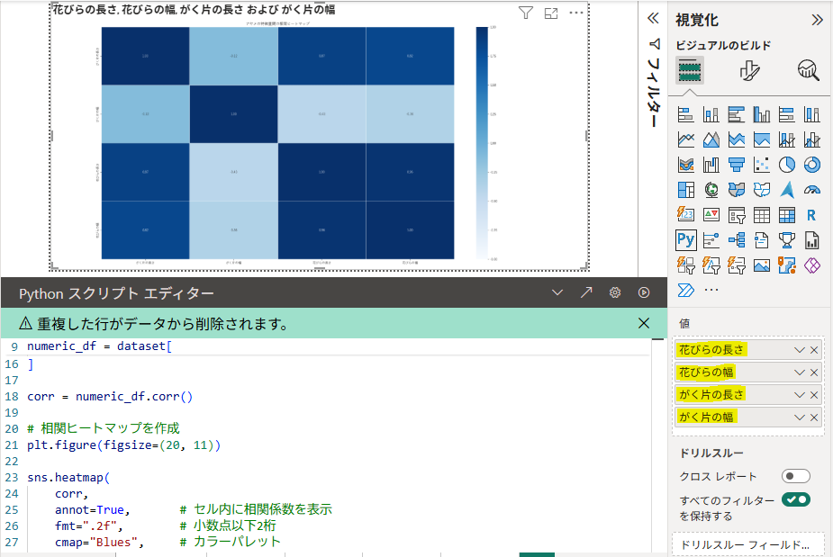


---

##### 【分析結果】

- `花びらの長さ`と`花びらの幅`には、**非常に強い正の相関**がある。
- `がく片の長さ`は、`花びらの長さ・幅`と**強い正の相関**がある。
- `がく片の幅`は、`花びらの長さ・幅`と**弱い負の相関**がある。
- 相関関係があっても、**一方の変数がもう一方の原因であるとは限らない。**

---

### 【課題】自動車データの相関分析

`自動車.csv`を使用して相関ヒートマップを作成し、結果を解釈する。

自動車データには、以下のような項目が含まれている。

```text
MPG（燃費）
cylinders（シリンダー数）
displacement（排気量）
horsepower（馬力）
weight（重量）
acceleration（加速度）
model_year（年式）
```

ヒートマップでは、`car_name`と`origin`を除外し、次の6つの数値列を使用する。

```python
numeric_df = dataset[
    [
        "mpg",
        "cylinders",
        "displacement",
        "horsepower",
        "weight",
        "acceleration"
    ]
]
```

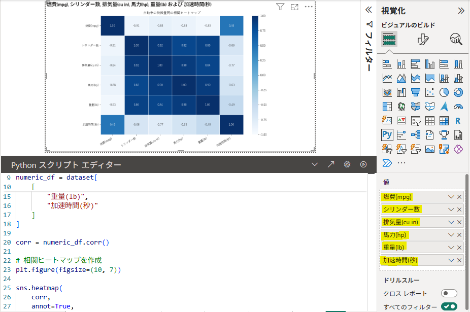

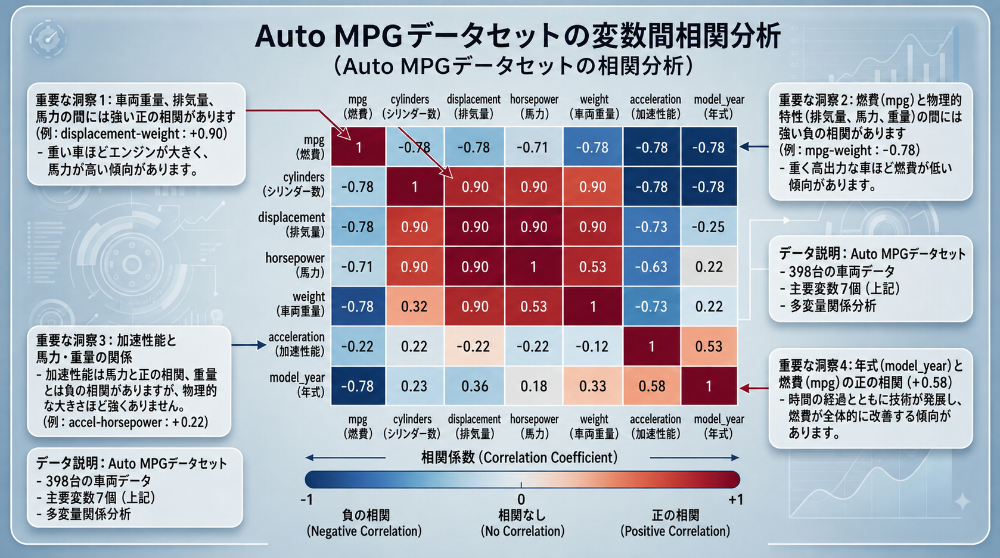

#### 【分析結果】

- 車両が重く、排気量や馬力が大きいほど、**燃費は低下する傾向**が見られる。
- 特に`重量(lb)`は`燃費(mpg)`との**負の相関が最も強く**、燃費との関連性が大きい。